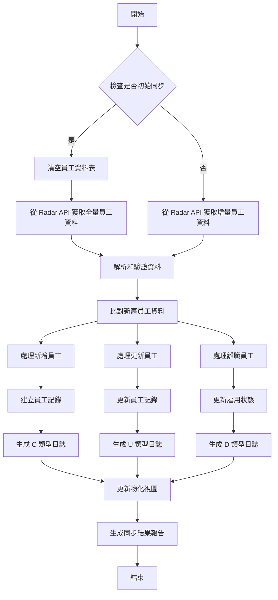
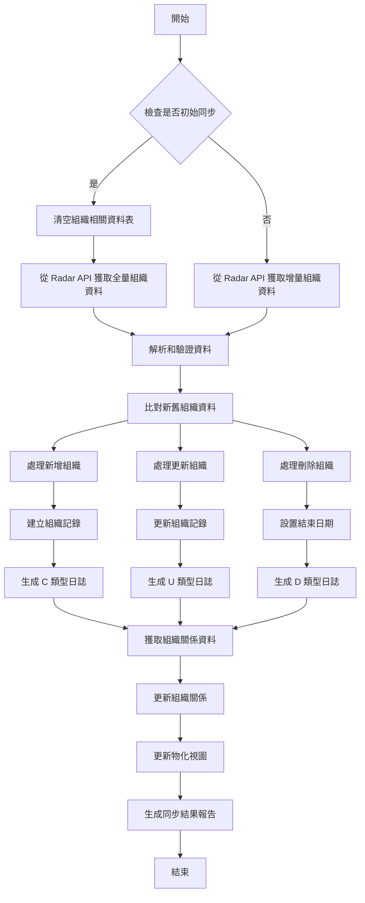
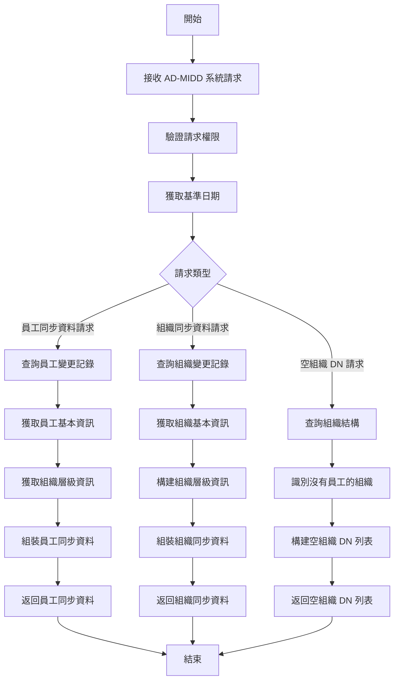
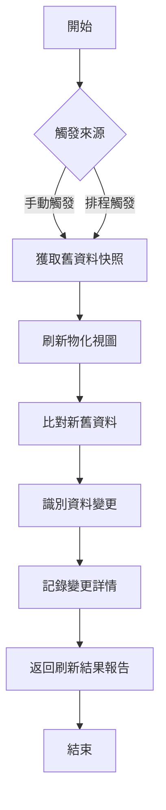
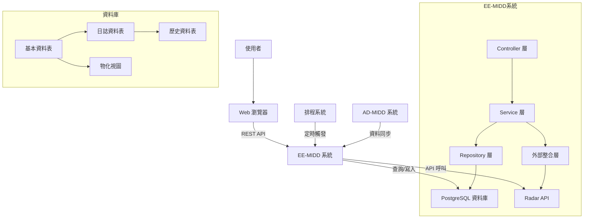
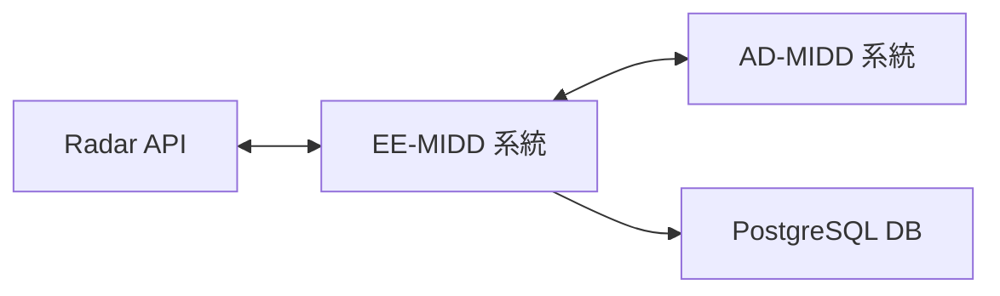
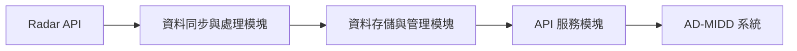
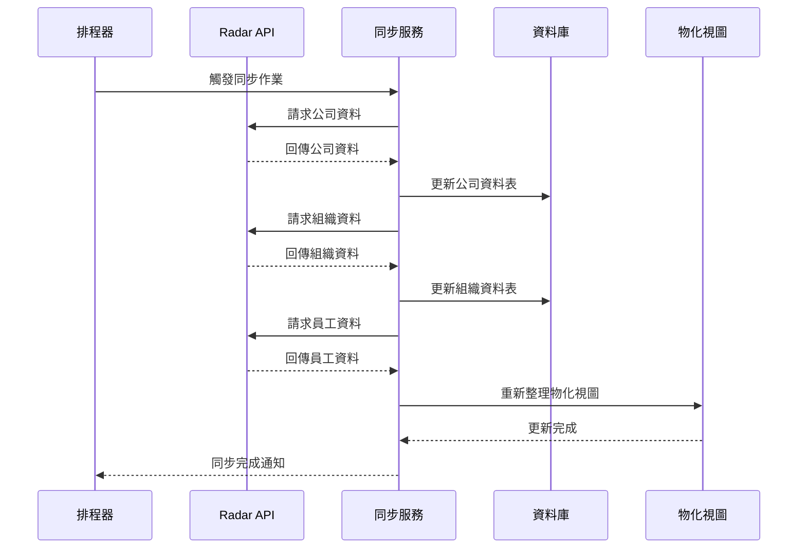
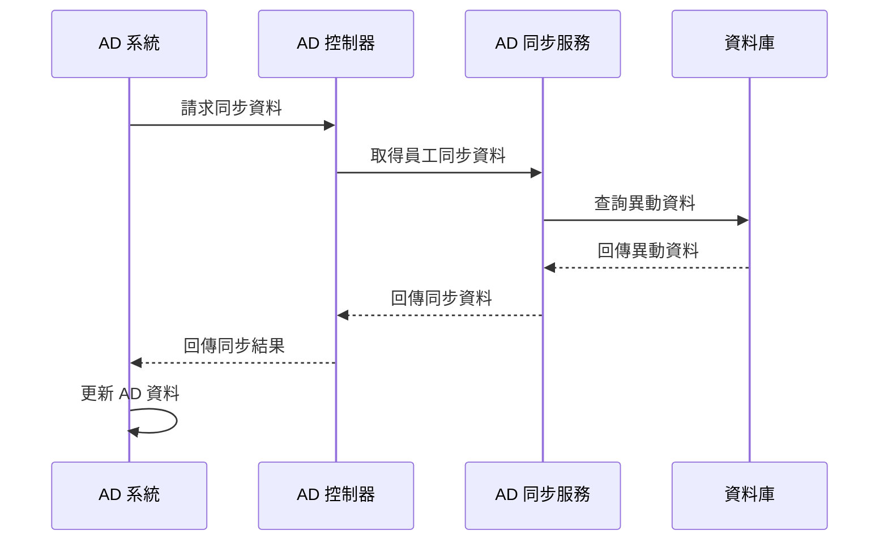

# SOGO 員工中台系統分析需求書

## 1. 緒論

### 1.1 文件目的與範圍

本文件旨在詳細描述太平洋崇光百貨股份有限公司（以下簡稱 SOGO）員工中台系統（Employee Middleware，以下簡稱 EE-MIDD）的系統需求分析，包含功能性和非功能性需求、系統架構、資料模型與外部系統整合等內容。本文件主要供系統開發團隊、測試團隊和管理階層參考，作為系統開發、測試與驗收的依據。

### 1.2 專案背景

SOGO 員工中台系統是一個整合性的員工資料管理平台，提供統一的介面來管理員工資料、組織結構和 AD 帳戶。本系統作為中介層，連接 HR 系統（Radar API）和 AD 中台系統（AD-MIDD），確保資料的同步和一致性。

系統主要解決以下問題：

- 集中管理員工資料和組織結構，成為單一資料來源
- 自動化員工資料從 HR 系統到 AD 系統的同步流程
- 提供標準化 API 接口，方便其他系統整合
- 確保資料一致性並提供審計軌跡

### 1.3 參考文件

1. Radar API 技術文件
2. Azure AD API 規範
3. Google RESTful API 設計規範
4. Spring Boot 2.7.18 官方文件
5. PostgreSQL 42.7.4 文件

### 1.4 術語與縮寫說明

| 縮寫/術語 | 全名/解釋                                          |
| --------- | -------------------------------------------------- |
| EE-MIDD   | Employee Middleware，員工中台系統                  |
| AD-MIDD   | AD Middleware，AD 中台系統                         |
| Radar API | HR 系統的 API 接口                                 |
| AD        | Active Directory，微軟的目錄服務                   |
| API       | Application Programming Interface，應用程式介面    |
| OU        | Organizational Unit，組織單位，AD 中的概念         |
| JWT       | JSON Web Token，用於安全傳輸資訊的開放標準         |
| DN        | Distinguished Name，在 AD 中用於唯一識別物件的路徑 |
| REST      | Representational State Transfer，一種架構風格      |

## 2. 系統概述

### 2.1 系統目標

EE-MIDD 系統旨在建立一個集中式的員工資料管理平台，實現以下主要目標：

1. 建立員工資料和組織結構的唯一真實來源（Single Source of Truth）
2. 自動化從 HR 系統（Radar API）獲取資料並進行處理和驗證
3. 提供標準化的 API 供 AD 中台系統（AD-MIDD）調用
4. 確保資料一致性，並記錄所有資料變更
5. 優化資料存取性能，支持高效的查詢和報表功能

### 2.2 系統功能簡述

EE-MIDD 系統提供的主要功能如下：

1. **員工資料同步管理**

   - 與 Radar API 系統整合
   - 自動同步員工基本資料
   - 處理資料變更並記錄變更歷史
2. **組織結構管理**

   - 同步組織架構資料
   - 處理組織關係與層級
   - 提供組織樹視圖
3. **AD 帳戶管理支援**

   - 提供 AD 帳戶同步所需資料
   - 提供組織單位同步資料
   - 支持空組織 DN 的識別
4. **資料整合服務**

   - RESTful API 服務
   - 物化視圖（Materialized View）優化
   - 資料一致性保證

### 2.3 系統架構

EE-MIDD 系統採用多層架構設計：

#### 2.3.1 技術架構

1. **後端框架與函式庫**

   - Spring Boot 2.7.18
   - Spring Security
   - Spring Data JPA
   - Spring Data JDBC
   - Spring Mail
   - Spring Validation
   - Lombok
   - JWT (jsonwebtoken 0.9.1)
2. **資料庫**

   - PostgreSQL 42.7.4
   - JPA/Hibernate ORM
3. **API 文件**

   - Springdoc OpenAPI UI 1.6.9
   - Swagger UI
4. **開發工具**

   - Java 8
   - Maven
   - Spring Boot DevTools
5. **監控與管理**

   - Spring Boot Actuator

#### 2.3.2 系統層次

1. **表現層（Presentation Layer）**

   - RESTful API 接口
   - Swagger UI 文件
2. **應用層（Application Layer）**

   - 業務邏輯實現
   - 資料轉換和驗證
   - 定時排程任務
3. **資料存取層（Repository 層）**

   - JPA Repositories
   - JDBC Templates
4. **資料庫層**

   - 資料表
   - 物化視圖
   - 索引與約束
5. **外部整合層（Integration Layer）**

   - Radar API 客戶端
   - AD-MIDD API 整合

### 2.4 使用者特徵與角色定義

本系統主要服務的使用者角色包括：

1. **系統管理員**

   - 負責系統的安裝、配置和維護
   - 監控系統運行狀態
   - 管理系統參數和設定
2. **IT 部門人員**

   - 使用 API 查詢員工和組織資料
   - 處理 AD 同步相關事宜
   - 檢視同步日誌和報告
3. **人資部門人員**

   - 透過 Radar API 維護員工資料
   - 檢視資料同步結果報告
   - 確認員工資料的準確性
4. **整合系統**

   - AD-MIDD 系統
   - 其他需要存取員工或組織資料的系統

## 3. 功能規格

### 3.1 核心功能模組

1. **員工資料管理**

   - 員工基本資料維護（APIEmployeeInfoService）
     * 新增、更新、查詢員工資料
     * 處理員工狀態變更
     * 記錄員工資料異動歷史
   - 組織架構管理（APIOrganizationService）
     * 維護組織基本資料
     * 處理組織狀態變更
     * 記錄組織異動歷史
   - 組織關係管理（APIOrganizationRelationService）
     * 維護組織階層關係
     * 處理不同類型的組織樹
     * 記錄組織關係變更
2. **BPM 系統整合**

   - 部門資料查詢（Fse7enOrgDeptInfoService）
   - 部門等級管理（Fse7enOrgDeptGradeInfoService）
   - 部門結構查詢（Fse7enOrgDeptStructService）
   - 職稱職等對應（Fse7enOrgJobTitle2GradeService）
   - 成員資訊查詢（Fse7enOrgMemberInfoService）
   - 成員結構查詢（Fse7enOrgMemberStructService）
   - 審批額度管理（EmployeeApprovalAmountService）
3. **Radar API 整合**

   - 公司資料同步（APICompanyService）
     * 從 Radar API 獲取公司資料
     * 處理公司資料更新
   - 組織資料同步（APIOrganizationService）
     * 從 Radar API 獲取組織資料
     * 處理組織資料更新
   - 員工資料同步（APIEmployeeInfoService）
     * 從 Radar API 獲取員工資料
     * 處理員工資料更新
   - 組織管理者同步（APIOrganizationManagerService）
     * 從 Radar API 獲取管理者資料
     * 處理管理者資料更新
4. **資料同步管理**

   - 物化視圖更新（MaterializedViewChangeService）
     * 追蹤視圖更新狀態
     * 記錄更新時間與結果
   - 資料異動記錄
     * 記錄所有資料變更
     * 保存變更歷史

### 3.2 詳細功能描述

#### 3.2.1 員工資料同步管理功能

**描述**：系統需要與 Radar API 進行整合，從中獲取員工的基本資料，並進行處理、存儲和提供存取。

**需求**：

- 系統需要能夠從 Radar API 獲取員工資料
- 支持增量同步和全量同步兩種模式
- 能夠識別並記錄員工資料變更
- 支持比較新舊資料並生成變更日誌
- 提供員工資料的查詢和篩選功能
- 處理在職、離職等不同狀態的員工資料

**業務規則**：

- 員工編號（employee_no）作為員工的唯一識別碼
- 員工狀態 1 表示在職，3 表示離職
- 員工資料變更需記錄操作類型、欄位名稱、舊值、新值和操作時間

#### 3.2.2 組織結構同步管理功能

**描述**：系統需要同步公司的組織架構，並處理組織之間的層級關係。

**需求**：

- 從 Radar API 獲取組織資料
- 處理組織關係資料，建立組織樹
- 支持多種組織樹結構（如功能型、表單型、公式型）
- 識別並記錄組織結構變更
- 提供組織樹查詢和瀏覽功能

**業務規則**：

- 組織代碼（org_code）作為組織的唯一識別碼
- 組織關係通過 parent_org_code 定義
- org_tree_type=0 表示公式型組織，=1 表示功能型組織，=2 表示表單型組織

#### 3.2.3 員工 AD 帳戶數據提供功能

**描述**：系統需要提供員工 AD 帳戶相關資料，供 AD-MIDD 系統進行 AD 帳戶操作。

**需求**：

- 提供員工 AD 同步所需的完整資料
- 識別並傳遞員工資料變更
- 支援檢查員工是否為組織管理者

**業務規則**：

- 需提供員工基本資料和組織層級結構
- 資料變更需包含操作類型、欄位和新舊值
- 員工電子郵件地址格式化為 employeeNo@sogo.com.tw

#### 3.2.4 組織單位（OU）數據提供功能

**描述**：系統需要提供組織單位資料，供 AD-MIDD 系統進行 OU 結構管理。

**需求**：

- 提供組織同步所需的完整資料
- 識別並傳遞組織結構變更
- 提供空組織 DN 識別功能

**業務規則**：

- 組織 DN 格式: OU=組織名,OU=父組織名,...,DC=sogo,DC=net
- 空組織定義：沒有子組織且沒有任何在職員工的組織

### 3.3 使用案例（Use Cases）

#### 3.3.1 員工資料同步

**主要執行者**：系統排程 / IT 管理員

**前置條件**：已配置 Radar API 連接參數

**主要流程**：

1. 系統從 Radar API 獲取員工資料
2. 系統解析並驗證獲取的資料
3. 系統將新資料與已有資料進行比較
4. 系統生成變更記錄
5. 系統更新資料庫中的員工資料
6. 系統返回同步結果

**替代流程**：

- 若獲取資料失敗，系統記錄錯誤並中止處理
- 若沒有新資料變更，系統僅記錄日誌

#### 3.3.2 組織結構同步

**主要執行者**：系統排程 / IT 管理員

**前置條件**：已配置 Radar API 連接參數

**主要流程**：

1. 系統從 Radar API 獲取組織資料
2. 系統解析並驗證獲取的資料
3. 系統將新資料與已有資料進行比較
4. 系統生成變更記錄
5. 系統更新資料庫中的組織資料
6. 系統更新組織關係資料
7. 系統返回同步結果

**替代流程**：

- 若獲取資料失敗，系統記錄錯誤並中止處理
- 若沒有新資料變更，系統僅記錄日誌

#### 3.3.3 查詢員工資料

**主要執行者**：外部系統 / IT 管理員

**前置條件**：具有系統存取權限

**主要流程**：

1. 執行者發送 API 請求，可能包含查詢條件
2. 系統驗證請求和權限
3. 系統從資料庫查詢相關員工資料
4. 系統格式化並返回查詢結果

**替代流程**：

- 若驗證失敗，系統返回權限錯誤
- 若未找到資料，系統返回空結果集

#### 3.3.4 查詢組織結構

**主要執行者**：外部系統 / IT 管理員

**前置條件**：具有系統存取權限

**主要流程**：

1. 執行者發送 API 請求，可能包含樹型結構類型
2. 系統驗證請求和權限
3. 系統從資料庫查詢相關組織資料和關係
4. 系統構建組織樹結構
5. 系統格式化並返回組織樹

**替代流程**：

- 若驗證失敗，系統返回權限錯誤
- 若未找到資料，系統返回空結果集

#### 3.3.5 獲取 AD 同步資料

**主要執行者**：AD-MIDD 系統

**前置條件**：AD-MIDD 系統具有 API 呼叫權限

**主要流程**：

1. AD-MIDD 系統發送 API 請求，包含基準日期
2. 系統驗證請求和權限
3. 系統查詢基準日期後的所有變更資料
4. 系統整合員工資料和組織層級資料
5. 系統格式化並返回 AD 同步所需資料

**替代流程**：

- 若驗證失敗，系統返回權限錯誤
- 若未找到變更資料，系統返回空結果集

#### 3.3.6 獲取空組織 DN 列表

**主要執行者**：AD-MIDD 系統

**前置條件**：AD-MIDD 系統具有 API 呼叫權限

**主要流程**：

1. AD-MIDD 系統發送 API 請求，可能包含組織樹類型
2. 系統驗證請求和權限
3. 系統分析組織結構，識別空組織
4. 系統為空組織構建 DN 路徑
5. 系統返回空組織 DN 列表

**替代流程**：

- 若驗證失敗，系統返回權限錯誤
- 若未找到空組織，系統返回空列表

#### 3.3.7 刷新物化視圖

**主要執行者**：IT 管理員 / 系統排程

**前置條件**：具有系統管理權限

**主要流程**：

1. 執行者觸發物化視圖刷新
2. 系統獲取最新資料並刷新物化視圖
3. 系統記錄視圖變更情況
4. 系統返回刷新結果

**替代流程**：

- 若刷新過程出錯，系統記錄錯誤並中止處理

#### 3.3.8 系統初始化

**主要執行者**：IT 管理員

**前置條件**：系統已安裝但資料庫為空

**主要流程**：

1. 管理員觸發系統初始化
2. 系統按順序從 Radar API 獲取所有基礎資料
3. 系統處理並存儲獲取的資料
4. 系統生成初始化報告
5. 系統返回初始化結果

**替代流程**：

- 若初始化過程中的任何步驟失敗，系統記錄錯誤並提供回滾選項

### 3.4 API 服務規格

#### 3.4.1 BPM API 服務

1. **部門資料查詢**

   ```
   主要參與者：BPM 系統
   前置條件：具備 API 存取權限
   基本流程：
   1. 呼叫相關 API：
      - GET /api/v1/bpm/dept-info：取得部門資訊
      - GET /api/v1/bpm/dept-grade-info：取得部門等級
      - GET /api/v1/bpm/dept-struct：取得部門結構
   2. 各 Service 層處理資料查詢
   3. 回傳格式化資料
   業務規則：
   - 資料分頁處理
   - 權限驗證
   ```
2. **職位管理**

   ```
   主要參與者：BPM 系統
   前置條件：具備 API 存取權限
   基本流程：
   1. 呼叫 GET /api/v1/bpm/job-title-grade
   2. Fse7enOrgJobTitle2GradeService 處理查詢
   3. 回傳職稱與職等對應資料
   業務規則：
   - 維護職稱職等對應關係
   - 確保資料一致性
   ```
3. **審批額度管理**

   ```
   主要參與者：BPM 系統
   前置條件：具備 API 存取權限
   基本流程：
   1. 呼叫 GET /api/v1/bpm/approval-amounts
   2. EmployeeApprovalAmountService 處理查詢
   3. 回傳審批額度設定
   業務規則：
   - 依據職等設定額度
   - 維護審批權限
   ```

#### 3.4.2 AD 同步 API 服務

1. **員工 AD 同步**

   ```
   主要參與者：AD 管理員
   前置條件：員工資料已更新
   基本流程：
   1. 呼叫 GET /api/v1/ad-employee-sync-data
   2. 提供參數：
      - base-date: 基準日期
   3. ADSyncService 處理同步邏輯
   4. 更新 AD 帳戶狀態
   業務規則：
   - 只同步在職員工
   - 依據異動類型處理帳戶
   ```
2. **組織 AD 同步**

   ```
   主要參與者：AD 管理員
   前置條件：組織資料已更新
   基本流程：
   1. 呼叫 GET /api/v1/ad-organization-sync-data
   2. 提供參數：
      - base-date: 基準日期
   3. ADSyncService 處理同步邏輯
   4. 更新 AD 組織結構
   業務規則：
   - 維護組織單位(OU)結構
   - 處理組織異動
   ```

#### 3.4.3 Radar 資料同步 API 服務

1. **系統初始化**

```
端點：POST /system/initialization
用途：執行系統完整初始化
請求參數：無
回應格式：
{
    "code": "200",
    "message": "success",
    "data": {
        "status": "SUCCESS",
        "message": "資料庫初始化成功"
    }
}
業務邏輯：
- 依序執行以下同步作業：
  1. 同步公司資料
  2. 同步組織資料
  3. 同步組織關係
  4. 同步組織管理者
  5. 同步員工資料
- 記錄同步結果
```

2. **初始化公司資料**

```
端點：POST /companies/initial-sync
用途：從 Radar API 同步公司資料
請求參數：無
回應格式：
{
    "code": "200",
    "message": "success",
    "data": "公司資訊同步成功"
}
業務邏輯：
- APICompanyService.processCompany() 處理資料更新
- 記錄同步日誌
```

3. **初始化組織資料**

```
端點：POST /organizations/initial-sync
用途：從 Radar API 同步組織資料
請求參數：
- org-code：組織代碼（選填）
- base-date：基準日期（選填）
回應格式：
{
    "code": "200",
    "message": "success",
    "data": "組織資訊同步成功"
}
業務邏輯：
- APIOrganizationService.processOrganization() 處理更新
```

4. **初始化組織管理者**

```
端點：POST /organization-managers/initial-sync
用途：從 Radar API 同步組織管理者資料
請求參數：
- org-code：組織代碼（選填）
- base-date：基準日期（選填）
回應格式：
{
    "code": "200",
    "message": "success",
    "data": "組織管理者資訊同步成功"
}
業務邏輯：
- APIOrganizationManagerService.processOrganizationManager() 處理更新
```

5. **初始化組織關係**

```
端點：POST /organization-relations/initial-sync
用途：從 Radar API 同步組織關係
請求參數：
- tree-type：組織樹類型（必填）
回應格式：
{
    "code": "200",
    "message": "success",
    "data": "組織關係同步成功"
}
業務邏輯：
- APIOrganizationRelationService.processOrganizationRelation() 處理更新
```

### 3.5 業務流程

#### 3.5.1 員工資料同步流程



#### 3.5.2 組織結構同步流程



#### 3.5.3 AD 資料同步支援流程



#### 3.5.4 物化視圖管理流程



### 3.6 組織樹視覺化功能

#### 3.6.1 功能概述

組織樹視覺化功能旨在提供直觀的方式來瀏覽和管理公司的組織結構，具有以下主要特點：

1. **階層式樹狀視圖**

   - 以樹狀圖的方式展示組織的層級結構
   - 支持展開/折疊節點
   - 使用視覺化圖標區分不同類型的節點
2. **搜索與過濾功能**

   - 依據組織代碼搜索特定部門
   - 依據員工編號搜索特定員工
   - 搜索結果會在樹狀圖中高亮顯示
3. **資料匯出功能**

   - 匯出成 Excel 檔案，便於報表生成
   - 匯出成 PowerShell 指令，用於 AD 批次操作
4. **組織詳情顯示**

   - 顯示組織代碼、名稱和層級
   - 顯示組織下屬員工列表
   - 使用不同顏色區分組織狀態（有效/無效）

#### 3.6.2 使用者介面

組織樹視覺化使用者介面包含以下主要元素：

1. **頂部功能區**

   - API URL 輸入框：用於指定資料來源
   - 載入樹按鈕：從指定的 API 獲取組織資料
   - 搜索工具：包含組織搜索和員工搜索
   - 匯出功能：Excel 和 PowerShell 匯出按鈕
2. **樹狀視圖區域**

   - 組織節點：顯示組織名稱和代碼
   - 組織子節點列表：顯示子組織
   - 員工列表：顯示組織下屬員工
   - 視覺化圖標：區分組織（文件夾圖標）和員工（使用者圖標）

#### 3.6.3 數據獲取與處理

組織樹視覺化功能通過以下方式獲取和處理資料：

1. **資料來源**

   - 從 `/api/v1/bpm` API 端點獲取組織結構資料
   - 支持根據不同的組織樹類型獲取不同的組織結構
2. **資料處理**

   - 將平面組織資料轉換為樹狀結構
   - 關聯員工資料到對應的組織節點
   - 計算節點的子節點數量和層級
3. **動態更新**

   - 樹狀視圖會根據資料變更動態更新
   - 支持實時搜索和過濾

#### 3.6.4 組織樹類型

系統支持三種不同類型的組織樹視圖：

1. **公式型組織樹（org_tree_type=0）**

   - 反映公司的實體組織架構
   - 通常用於正式的組織報表和 AD 結構
2. **功能型組織樹（org_tree_type=1）**

   - 反映公司的功能性分組
   - 用於特定業務功能的管理
3. **表單型組織樹（org_tree_type=2）**

   - 用於公司的行政審批流程
   - 反映審批層級和權限結構

#### 3.6.5 技術實現

組織樹視覺化功能的技術實現包括：

1. **前端技術**

   - 使用原生 JavaScript 實現樹狀結構渲染
   - 使用 CSS 實現樹狀視圖的樣式和交互效果
   - 使用 xlsx.js 庫實現 Excel 導出功能
2. **後端支持**

   - RESTful API 提供組織資料
   - 後端數據庫查詢支持不同類型的組織樹結構
   - 提供員工和組織的關聯數據
3. **數據傳輸**

   - 使用 JSON 格式進行資料交換
   - 支持分頁獲取大量資料

#### 3.6.6 其他特性

1. **空組織識別**

   - 識別並標記沒有任何在職員工的組織（空組織）
   - 支持生成空組織的 DN 列表，供 AD 管理使用
2. **使用權限控制**

   - 基於使用者角色的訪問控制
   - 僅允許授權用戶訪問組織樹視圖
3. **加載狀態提示**

   - 資料載入過程中顯示加載指示器
   - 提供操作反饋提示

## 4. 資料架構

### 4.1 資料庫設計

#### 4.1.1 資料表結構

1. 員工相關資料表

   ```
   - api_employee_info：員工基本資料表
     * id (bigint)：主鍵，自動遞增
     * arcidno (varchar(20))：身份證字號
     * company_code (varchar(20))：公司代碼
     * company_name (varchar(50))：公司名稱
     * company_partyid (bigint)：公司 party ID
     * country_code (varchar(10))：國家代碼
     * created_date (timestamp with time zone)：建立日期
     * data_created_date (timestamp with time zone)：資料建立日期
     * data_created_user (varchar(30))：資料建立者
     * data_modified_date (timestamp with time zone)：資料修改日期
     * data_modified_user (varchar(30))：資料修改者
     * date_of_birth (timestamp with time zone)：出生日期
     * email_address (varchar(50))：電子郵件
     * employed_status (varchar(2))：在職狀態 (1:在職, 2:留職停薪, 3:離職)
     * employee_no (varchar(10))：員工編號
     * employee_type_code (varchar(10))：員工類型代碼
     * employee_type_name (varchar(20))：員工類型名稱
     * english_name (varchar(50))：英文名稱
     * ext_no (varchar(10))：分機號碼
     * form_org_code (varchar(20))：表單組織代碼
     * form_org_name (varchar(50))：表單組織名稱
     * form_org_partyid (bigint)：表單組織黨派ID
     * formula_org_code (varchar(20))：實體組織代碼
     * formula_org_name (varchar(50))：實體組織名稱
     * formula_org_partyid (bigint)：實體組織 party ID
     * full_name (varchar(50))：姓名
     * function_org_code (varchar(20))：功能組織代碼
     * function_org_name (varchar(50))：功能組織名稱
     * gender_code (varchar(2))：性別代碼
     * gender_name (varchar(10))：性別名稱
     * hire_date (timestamp with time zone)：到職日期
     * idno (varchar(20))：身分證字號
     * idno_suffix (varchar(10))：身分證字號後綴
     * job_flag (varchar(2))：職位標誌
     * job_grade_code (varchar(10))：職等代碼
     * job_grade_name (varchar(20))：職等名稱
     * job_level_code (varchar(10))：職級代碼
     * job_level_name (varchar(20))：職級名稱
     * job_title_code (varchar(10))：職稱代碼
     * job_title_name (varchar(20))：職稱名稱
     * mobile_phone_no (varchar(20))：手機號碼
     * mvpn (varchar(20))：行動虛擬專用網
     * office_phone (varchar(20))：辦公電話
     * party_roleid (bigint)：party 角色ID
     * passport_no (varchar(30))：護照號碼
     * permanent_address (varchar(50))：永久地址
     * permanent_phone_no (varchar(20))：永久電話號碼
     * permanent_zip_code (varchar(10))：永久郵遞區號
     * position_code (varchar(10))：職位代碼
     * position_name (varchar(20))：職位名稱
     * present_address (varchar(50))：現居地址
     * present_phone_no (varchar(20))：現居電話號碼
     * present_zip_code (varchar(10))：現居郵遞區號
     * resignation_date (timestamp with time zone)：離職日期
     * status (varchar(2))：狀態
     * tenantid (varchar(10))：租戶ID
     * userid (varchar(10))：用戶ID

   - api_employee_info_action_log：員工資料異動紀錄表
     * id (bigint)：主鍵，自動遞增
     * action (varchar(10))：異動類型（新增/修改/刪除）
     * action_date (timestamp with time zone)：異動時間
     * created_date (timestamp with time zone NOT NULL)：建立時間
     * employee_no (varchar(10) NOT NULL)：員工編號
     * field_name (varchar(30) NOT NULL)：異動欄位
     * new_value (varchar(50))：新值
     * old_value (varchar(50))：原始值
     * party_roleid (bigint)：黨派角色ID

   - api_employee_info_archived：員工歷史資料表
     * id (bigint)：主鍵，自動遞增
     * arcidno (varchar(20))：居留證字號
     * company_code (varchar(20))：公司代碼
     * company_name (varchar(50))：公司名稱
     * company_partyid (bigint)：公司黨派ID
     * country_code (varchar(10))：國家代碼
     * created_date (timestamp with time zone)：建立日期
     * data_created_date (timestamp with time zone)：資料建立日期
     * data_created_user (varchar(30))：資料建立者
     * data_modified_date (timestamp with time zone)：資料修改日期
     * data_modified_user (varchar(30))：資料修改者
     * date_of_birth (timestamp with time zone)：出生日期
     * email_address (varchar(50))：電子郵件
     * employed_status (varchar(2))：在職狀態
     * employee_no (varchar(10))：員工編號
     * employee_type_code (varchar(10))：員工類型代碼
     * employee_type_name (varchar(20))：員工類型名稱
     * english_name (varchar(50))：英文名稱
     * ext_no (varchar(10))：分機號碼
     * form_org_code (varchar(20))：表單組織代碼
     * form_org_name (varchar(50))：表單組織名稱
     * form_org_partyid (bigint)：表單組織黨派ID
     * formula_org_code (varchar(20))：實體組織代碼
     * formula_org_name (varchar(50))：實體組織名稱
     * formula_org_partyid (bigint)：實體組織黨派ID
     * full_name (varchar(20))：姓名
     * function_org_code (varchar(20))：功能組織代碼
     * function_org_name (varchar(50))：功能組織名稱
     * gender_code (varchar(2))：性別代碼
     * gender_name (varchar(10))：性別名稱
     * hire_date (timestamp with time zone)：到職日期
     * idno (varchar(20))：身分證字號
     * idno_suffix (varchar(10))：身分證字號後綴
     * job_flag (varchar(2))：職位標誌
     * job_grade_code (varchar(10))：職等代碼
     * job_grade_name (varchar(20))：職等名稱
     * job_level_code (varchar(10))：職級代碼
     * job_level_name (varchar(20))：職級名稱
     * job_title_code (varchar(10))：職稱代碼
     * job_title_name (varchar(20))：職稱名稱
     * mobile_phone_no (varchar(20))：手機號碼
     * mvpn (varchar(20))：行動虛擬專用網
     * office_phone (varchar(20))：辦公電話
     * party_roleid (bigint)：黨派角色ID
     * passport_no (varchar(30))：護照號碼
     * permanent_address (varchar(50))：永久地址
     * permanent_phone_no (varchar(20))：永久電話號碼
     * permanent_zip_code (varchar(10))：永久郵遞區號
     * position_code (varchar(10))：職位代碼
     * position_name (varchar(20))：職位名稱
     * present_address (varchar(50))：現居地址
     * present_phone_no (varchar(20))：現居電話號碼
     * present_zip_code (varchar(10))：現居郵遞區號
     * resignation_date (timestamp with time zone)：離職日期
     * status (varchar(2))：狀態
     * tenantid (varchar(10))：租戶ID
     * userid (varchar(10))：用戶ID
   ```
2. 組織相關資料表

   ```
   - api_organization：組織基本資料表
     * id (bigint)：主鍵，自動遞增
     * address (varchar(50))：地址
     * company_code (varchar(20))：公司代碼
     * company_name (varchar(50))：公司名稱
     * company_partyid (bigint)：公司黨派ID
     * created_date (timestamp with time zone)：建立日期
     * data_created_date (timestamp with time zone)：資料建立日期
     * data_created_user (varchar(30))：資料建立者
     * data_modified_date (timestamp with time zone)：資料修改日期
     * data_modified_user (varchar(30))：資料修改者
     * email (varchar(50))：電子郵件
     * end_date (timestamp with time zone)：結束日期
     * english_name (varchar(50))：英文名稱
     * fax (varchar(10))：傳真
     * layer_code (varchar(5))：層級代碼
     * layer_name (varchar(20))：層級名稱
     * org_code (varchar(20))：組織代碼
     * org_name (varchar(50))：組織名稱
     * org_property_code (varchar(2))：組織屬性代碼
     * organizationid (bigint)：組織ID
     * remark (varchar(20))：備註
     * sort_sequence (integer)：排序序號
     * start_date (timestamp with time zone)：開始日期
     * status (varchar(2))：狀態
     * telephone (varchar(20))：電話號碼
     * tenantid (varchar(10))：租戶ID

   - api_organization_relation：組織關係表
     * id (bigint)：主鍵，自動遞增
     * company_code (varchar(20))：公司代碼
     * company_party_id (bigint)：公司黨派ID
     * created_date (timestamp with time zone)：建立日期
     * data_created_date (timestamp with time zone)：資料建立日期
     * data_created_user (varchar(30))：資料建立者
     * data_modified_date (timestamp with time zone)：資料修改日期
     * data_modified_user (varchar(30))：資料修改者
     * org_code (varchar(20))：組織代碼
     * org_name (varchar(50))：組織名稱
     * org_tree_type (varchar(2))：組織樹類型 (0:公式, 1:功能, 2:表單)
     * organization_relation_id (bigint)：組織關係ID
     * parent_org_code (varchar(20))：上級組織代碼
     * status (varchar(2))：狀態
     * tenant_id (varchar(10))：租戶ID

   - api_organization_manager：組織管理者表
     * id (bigint)：主鍵，自動遞增
     * company_code (varchar(20))：公司代碼
     * company_partyid (bigint)：公司黨派ID
     * created_date (timestamp with time zone)：建立日期
     * data_created_date (timestamp with time zone)：資料建立日期
     * data_created_user (varchar(30))：資料建立者
     * data_modified_date (timestamp with time zone)：資料修改日期
     * data_modified_user (varchar(30))：資料修改者
     * effective_date (timestamp with time zone)：生效日期
     * employee_no (varchar(10))：員工編號
     * end_date (timestamp with time zone)：結束日期
     * full_name (varchar(20))：姓名
     * is_deputy (boolean)：是否為代理人
     * manager_role_type (varchar(2))：管理者角色類型
     * org_code (varchar(20))：組織代碼
     * organization_managerid (bigint)：組織管理者ID
     * status (varchar(2))：狀態
     * tenantid (varchar(10))：租戶ID

   - api_organization_action_log：組織異動紀錄表
     * id (bigint)：主鍵，自動遞增
     * action (varchar(10))：異動類型
     * action_date (timestamp with time zone)：異動時間
     * created_date (timestamp with time zone NOT NULL)：建立時間
     * field_name (varchar(30) NOT NULL)：異動欄位
     * new_value (varchar(50))：新值
     * old_value (varchar(50))：原始值
     * org_code (varchar(20) NOT NULL)：組織代碼
     * organizationid (bigint)：組織ID

   - api_organization_archived：組織歷史資料表
     * id (bigint)：主鍵，自動遞增
     * address (varchar(50))：地址
     * company_code (varchar(20))：公司代碼
     * company_name (varchar(50))：公司名稱
     * company_partyid (bigint)：公司黨派ID
     * created_date (timestamp with time zone)：建立日期
     * data_created_date (timestamp with time zone)：資料建立日期
     * data_created_user (varchar(30))：資料建立者
     * data_modified_date (timestamp with time zone)：資料修改日期
     * data_modified_user (varchar(30))：資料修改者
     * email (varchar(50))：電子郵件
     * end_date (timestamp with time zone)：結束日期
     * english_name (varchar(50))：英文名稱
     * fax (varchar(10))：傳真
     * layer_code (varchar(5))：層級代碼
     * layer_name (varchar(20))：層級名稱
     * org_code (varchar(20))：組織代碼
     * org_name (varchar(50))：組織名稱
     * org_property_code (varchar(2))：組織屬性代碼
     * organizationid (bigint)：組織ID
     * remark (varchar(20))：備註
     * sort_sequence (integer)：排序序號
     * start_date (timestamp with time zone)：開始日期
     * status (varchar(2))：狀態
     * telephone (varchar(20))：電話號碼
     * tenantid (varchar(10))：租戶ID

   - api_organization_relation_action_log：組織關係異動紀錄表
     * id (bigint)：主鍵，自動遞增
     * action (varchar(10) NOT NULL)：異動類型
     * action_date (timestamp with time zone NOT NULL)：異動時間
     * created_date (timestamp with time zone NOT NULL)：建立時間
     * field_name (varchar(30) NOT NULL)：異動欄位
     * is_sync (boolean)：是否已同步
     * new_value (varchar(50))：新值
     * old_value (varchar(50))：原始值
     * org_code (varchar(20) NOT NULL)：組織代碼
     * organization_relation_id (bigint)：組織關係ID

   - api_organization_relation_archived：組織關係歷史資料表
     * id (bigint)：主鍵，自動遞增
     * archived_date (timestamp with time zone)：封存日期
     * company_code (varchar(20))：公司代碼
     * company_party_id (bigint)：公司黨派ID
     * created_date (timestamp with time zone)：建立日期
     * data_created_date (timestamp with time zone)：資料建立日期
     * data_created_user (varchar(30))：資料建立者
     * data_modified_date (timestamp with time zone)：資料修改日期
     * data_modified_user (varchar(30))：資料修改者
     * org_code (varchar(20))：組織代碼
     * org_name (varchar(50))：組織名稱
     * org_tree_type (varchar(2))：組織樹類型
     * organization_relation_id (bigint)：組織關係ID
     * parent_org_code (varchar(20))：上級組織代碼
     * status (varchar(2))：狀態
     * tenant_id (varchar(10))：租戶ID
   ```
3. 審批相關資料表

   ```
   - approved_amount_for_each_layer：各層級審批額度表
     * layer_code (varchar(10) NOT NULL)：層級代碼，主鍵
     * layer_description (varchar(20))：層級描述
     * max_capital_fee (numeric(18,2))：最大資本費用額度
     * max_expense_fee (numeric(18,2))：最大支出費用額度
     * max_payment_penalty_fee (numeric(18,2))：最大付款罰金額度
     * max_payment_relation_fee (numeric(18,2))：最大關係人付款額度
     * max_payment_current_capital_fee (numeric(18,2))：最大當期資本支出額度
     * max_payment_regular_expense_fee (numeric(18,2))：最大常規支出額度
     * max_payment_other_capital_fee (numeric(18,2))：最大其他資本支出額度
     * max_payment_other_expense_fee (numeric(18,2))：最大其他費用額度
   ```
4. 系統管理資料表

   ```
   - materialized_view_refresh_log：物化視圖更新紀錄表
     * id (bigint)：主鍵，自動遞增
     * view_name (varchar(255) NOT NULL)：視圖名稱
     * refreshed_at (timestamp with time zone NOT NULL DEFAULT CURRENT_TIMESTAMP)：更新時間
     * diff_count (integer)：差異筆數
     * diff_details (jsonb)：差異詳情，JSON格式
   ```
5. 公司相關資料表

   ```
   - api_company：公司基本資料表
     * id (bigint)：主鍵，自動遞增
     * company_code (varchar(20))：公司代碼
     * company_name (varchar(50))：公司名稱
     * company_partyid (bigint)：公司 party ID
     * created_date (timestamp with time zone)：建立日期
     * data_created_date (timestamp with time zone)：資料建立日期
     * data_created_user (varchar(30))：資料建立者
     * data_modified_date (timestamp with time zone)：資料修改日期
     * data_modified_user (varchar(30))：資料修改者
     * effective_date (timestamp with time zone)：生效日期
     * status (varchar(2))：狀態
     * tenantid (varchar(20))：租戶ID
   ```
6. 物化視圖(Materialized Views)

   ```
   - fse7en_org_deptgradeinfo：部門等級資訊視圖
     * grade_id (text)：等級ID，格式為"Level" + 階層深度
     * display_name (text)：顯示名稱，格式為"第X階"
     * grade_num (text)：等級編號，格式為"-" + 階層深度

   - fse7en_org_deptinfo：部門基本資訊視圖
     * org_code (varchar)：組織代碼
     * org_name (varchar)：組織名稱

   - fse7en_org_deptstruct：部門結構視圖
     * org_code (varchar)：組織代碼
     * parent_org_code (varchar)：上級組織代碼
     * grade_id (text)：等級ID
     * grade_num (text)：等級編號
     * top_orgtree_code (varchar)：最上層組織代碼

   - fse7en_org_memberinfo：成員資訊視圖
     * employee_no (varchar)：員工編號
     * full_name (varchar)：全名
     * ext_no (varchar)：分機號碼
     * email_address (varchar)：電子郵件地址
     * isterminated (text)：離職狀態（0：在職，1：離職）
     * hire_date (timestamp with time zone)：到職日期
     * azureaccount (varchar)：Azure帳號

   - fse7en_org_jobtitle2grade：職稱等級對應視圖
     * job_title_code (varchar)：職稱代碼
     * job_title_name (varchar)：職稱名稱
     * job_grade (text)：職等

   - fse7en_org_memberstruct：成員結構視圖
     * employee_no (varchar)：員工編號
     * full_name (varchar)：全名
     * org_code (varchar)：所屬組織代碼
     * org_name (varchar)：組織名稱
     * job_title_code (varchar)：職稱代碼
     * job_grade (text)：職等
     * is_main_job (text)：是否為主要職位（1：是，0：否）
     * approve_right (text)：是否具有審批權限（0：否，1：是）
     * enable (text)：是否啟用（0：否，1：是）
     * instructor (text)：指導者資訊（格式：員工編號@組織代碼）
   ```
7. 視圖(Views)

   ```
   - view_employee_approval_amount：員工審批金額視圖
     * employee_no (varchar)：員工編號
     * full_name (varchar)：全名
     * job_title_code (varchar)：職稱代碼
     * job_title_name (varchar)：職稱名稱
     * layer_code (varchar)：層級代碼
     * layer_name (varchar)：層級名稱
     * layer_description (varchar)：層級描述
     * formula_org_code (varchar)：實體組織代碼
     * formula_org_name (varchar)：實體組織名稱
     * form_org_code (varchar)：表單組織代碼
     * form_org_name (varchar)：表單組織名稱
     * max_capital_fee (numeric)：最大資本費用額度
     * max_expense_fee (numeric)：最大支出費用額度
     * max_payment_penalty_fee (numeric)：最大付款罰金額度
     * max_payment_relation_fee (numeric)：最大關係人付款額度
     * max_payment_current_capital_fee (numeric)：最大當期資本支出額度
     * max_payment_regular_expense_fee (numeric)：最大常規支出額度
     * max_payment_other_capital_fee (numeric)：最大其他資本支出額度
     * max_payment_other_expense_fee (numeric)：最大其他費用額度
   ```

### 4.2 資料字典

#### 4.2.1 代碼說明

1. 員工狀態代碼 (employed_status)

   ```
   1: 在職
   2: 留職停薪
   3: 離職
   ```
2. 組織樹類型 (org_tree_type)

   ```
   0: 實體組織
   1: 功能組織
   2: 表單組織
   ```
3. 資料狀態代碼 (status)

   ```
   1: 有效
   0: 無效
   2: 暫停
   3: 待審核
   ```
4. 異動類型代碼 (action)

   ```
   CREATE: 新增
   UPDATE: 修改
   DELETE: 刪除
   ARCHIVE: 封存
   RESTORE: 還原
   ```

#### 4.2.2 資料完整性規則

1. 主鍵限制

   ```
   - 所有資料表都使用自增的 id 欄位作為主鍵
   - 業務邏輯識別碼規則：
     * employee_no：固定長度 10 碼
     * org_code：最大長度 20 碼
     * job_title_code：固定長度 10 碼
   ```
2. 外鍵關聯

   ```
   - api_employee_info_action_log：
     * employee_no 參照 api_employee_info(employee_no)

   - api_organization_relation：
     * org_code 參照 api_organization(org_code)
     * parent_org_code 參照 api_organization(org_code)

   - api_organization_manager：
     * org_code 參照 api_organization(org_code)
     * employee_no 參照 api_employee_info(employee_no)

   - api_organization_action_log：
     * org_code 參照 api_organization(org_code)
   ```
3. 資料驗證規則

   ```
   - 員工編號格式：
     * 必須為 10 碼
     * 第一碼為英文字母
     * 後 9 碼為數字

   - 電子郵件地址：
     * 必須符合 email 格式
     * 必須使用公司域名 (@sogo.com.tw)

   - 日期資料：
     * 到職日期不得晚於當前日期
     * 異動時間不得晚於當前時間

   - 組織代碼：
     * 最大長度 20 碼
     * 必須由英文字母或數字組成
     * 不得包含特殊字元
   ```
4. 唯一性限制

   ```
   - api_employee_info：
     * employee_no 唯一
     * email_address 唯一
     * azure_account 唯一

   - api_organization：
     * org_code 唯一

   - api_organization_relation：
     * org_code + parent_org_code + tree_type 組合唯一

   - api_organization_manager：
     * org_code + employee_no 組合唯一
   ```
5. 強制性欄位

   ```
   - api_employee_info：
     * employee_no
     * full_name
     * employed_status
     * hire_date

   - api_organization：
     * org_code
     * org_name
     * status

   - api_organization_relation：
     * org_code
     * tree_type
     * level
   ```
6. 稽核追蹤

   ```
   - 異動紀錄規則：
     * 所有異動都必須記錄在對應的 action_log 表
     * 必須記錄異動前後的值
     * 必須記錄異動時間和操作者

   - 封存規則：
     * 重要資料異動前先封存到 archived 表
     * 封存資料使用 jsonb 格式保存完整資訊
     * 封存時間必須記錄
   ```
7. 資料一致性規則

   ```
   - 組織架構一致性：
     * 組織關係不得形成循環
     * 同一組織樹類型中，組織層級必須連續
     * 組織狀態變更時，需同步更新相關資料

   - 員工資料一致性：
     * 在職員工必須至少屬於一個組織
     * 員工的主要職位只能有一個
     * 職稱必須對應到有效的職等
   ```

### 4.3 視圖結構

#### 4.3.1 視圖定義

系統使用以下物化視圖來優化查詢效能和資料整合：

1. **部門等級資訊視圖 (fse7en_org_deptgradeinfo)**

   - 用途：提供部門的階層等級資訊
   - 主要欄位：
     - grade_id：等級ID，格式為"Level" + 階層深度
     - display_name：顯示名稱，格式為"第X階"
     - grade_num：等級編號，格式為"-" + 階層深度
   - 資料來源：基於 api_organization_relation 和 api_organization 表
2. **部門基本資訊視圖 (fse7en_org_deptinfo)**

   - 用途：提供部門的基本資訊
   - 主要欄位：
     - org_code：組織代碼
     - org_name：組織名稱
   - 資料來源：基於 api_organization 和 api_organization_relation 表
3. **部門結構視圖 (fse7en_org_deptstruct)**

   - 用途：提供部門的階層結構資訊
   - 主要欄位：
     - org_code：組織代碼
     - parent_org_code：上級組織代碼
     - grade_id：等級ID
     - grade_num：等級編號
     - top_orgtree_code：最上層組織代碼
   - 資料來源：基於 api_organization_relation 和 api_organization 表
4. **成員資訊視圖 (fse7en_org_memberinfo)**

   - 用途：提供員工基本資訊
   - 主要欄位：
     - employee_no：員工編號
     - full_name：全名
     - ext_no：分機號碼
     - email_address：電子郵件地址
     - isterminated：離職狀態（0：在職，1：離職）
     - hire_date：到職日期
     - azureaccount：Azure帳號
   - 資料來源：基於 api_employee_info 表
5. **職稱等級對應視圖 (fse7en_org_jobtitle2grade)**

   - 用途：提供職稱與等級的對應關係
   - 主要欄位：
     - job_title_code：職稱代碼
     - job_title_name：職稱名稱
     - job_grade：職等
   - 資料來源：基於 api_employee_info 表
6. **成員結構視圖 (fse7en_org_memberstruct)**

   - 用途：提供成員在組織中的詳細資訊
   - 主要欄位：
     - employee_no：員工編號
     - full_name：全名
     - org_code：所屬組織代碼
     - org_name：組織名稱
     - job_title_code：職稱代碼
     - job_grade：職等
     - is_main_job：是否為主要職位（0：是，1：否）
     - approve_right：是否具有審批權限（0：否，1：是）
     - enable：是否啟用（0：否，1：是）
     - instructor：指導者資訊（格式：員工編號@組織代碼）
   - 資料來源：基於 api_employee_info 和 api_organization_manager 表

#### 4.3.2 資料更新機制

系統提供以下機制來確保物化視圖的資料即時性：

1. **物化視圖更新函數 (refresh_materialized_view_with_log)**

   - 功能：更新指定的物化視圖並記錄變更
   - 記錄內容：
     - 刪除的記錄數
     - 新增的記錄數
     - 更新的記錄數
     - 更新時間戳記
2. **批次更新函數 (refresh_all_materialized_views)**

   - 功能：依序更新所有物化視圖
   - 執行順序：按照資料相依性順序執行更新
3. **變更追蹤函數 (get_materialized_view_changes_by_date)**

   - 功能：查詢指定日期後的視圖變更記錄
   - 回傳資訊：
     - 視圖名稱
     - 更新時間
     - 變更筆數
     - 變更明細

### 4.4 資料庫函數

系統使用多種資料庫函數來實現核心業務邏輯和優化查詢效能。以下是主要的資料庫函數說明：

#### 4.4.1 組織結構查詢函數

1. **get_actived_org_tree**

   - 功能：根據指定的組織樹類型，獲取活躍的組織樹結構
   - 參數：
     * p_org_tree_type (varchar)：組織樹類型（0: 實體, 1: 功能, 2: 表單）
   - 返回：包含組織基本資訊和關係的表格結果集
   - 說明：用於構建組織樹視圖，只返回狀態為活躍的組織
2. **get_org_hierarchy_by_org_code**

   - 功能：根據組織代碼獲取組織的階層結構
   - 參數：
     * p_org_code (varchar)：組織代碼
     * p_org_tree_type (varchar)：組織樹類型
   - 返回：包含從指定組織到頂層的所有組織層級
   - 說明：用於生成組織 DN 路徑和計算組織深度
3. **get_employees_by_org_code**

   - 功能：根據組織代碼獲取該組織下的所有員工
   - 參數：
     * p_org_code (varchar)：組織代碼
     * p_org_tree_type (varchar)：組織樹類型
   - 返回：該組織下所有員工的詳細資料
   - 說明：用於 AD 同步和組織樹員工展示

#### 4.4.2 員工關係查詢函數

1. **get_employee_no_by_org_hierarchy**

   - 功能：根據員工編號和組織樹類型，獲取該員工的組織層級資訊
   - 參數：
     * p_employee_no (varchar)：員工編號
     * p_org_tree_type (varchar)：組織樹類型
   - 返回：員工的組織層級資訊，包含從員工所在組織到頂層的所有層級
   - 說明：用於查詢員工的組織路徑和權限判斷
2. **find_approval_manager**

   - 功能：查找特定員工的審批主管
   - 參數：
     * p_employee_no (varchar)：員工編號
     * p_tree_type (varchar, 預設值='2')：組織樹類型，預設為表單組織
   - 返回：審批主管的資訊（員工編號、姓名、組織代碼、組織名稱）
   - 說明：用於審批流程的主管判定

#### 4.4.3 物化視圖管理函數

1. **get_materialized_view_changes_by_date**

   - 功能：根據日期查詢物化視圖的變更記錄
   - 參數：
     * p_date (date)：基準日期
     * p_view_name (varchar, 可選)：視圖名稱
   - 返回：視圖名稱、更新時間、變更筆數和變更詳情
   - 說明：用於追蹤視圖變更歷史，支援監控和審計
2. **refresh_materialized_view_with_log**

   - 功能：重新整理特定物化視圖並記錄變更
   - 參數：
     * p_view_name (varchar)：視圖名稱
   - 返回：操作結果（成功/失敗）
   - 說明：在視圖更新時記錄差異，用於變更追蹤
3. **refresh_all_materialized_views**

   - 功能：按順序重新整理所有物化視圖
   - 參數：無
   - 返回：操作結果（成功/失敗）
   - 說明：系統排程任務使用此函數進行定期更新

#### 4.4.4 輔助查詢函數

1. **check_is_manager**

   - 功能：檢查特定員工是否為指定組織的管理者
   - 參數：
     * p_employee_no (varchar)：員工編號
     * p_org_code (varchar)：組織代碼
   - 返回：布林值（true/false）
   - 說明：用於權限判斷和管理者標記
2. **build_organization_dn**

   - 功能：構建組織的 DN (Distinguished Name) 路徑
   - 參數：
     * p_org_code (varchar)：組織代碼
     * p_org_tree_type (varchar)：組織樹類型
   - 返回：完整的 DN 路徑字串
   - 說明：用於 AD 同步時的組織 OU 路徑生成

#### 4.4.5 審批金額計算函數

1. **get_employee_approval_amount**

   - 功能：獲取員工的審批金額限制
   - 參數：
     * p_employee_no (varchar)：員工編號
   - 返回：包含各種審批類型金額上限的結果集
   - 說明：用於審批流程中的金額限制判斷
2. **calculate_approval_limit**

   - 功能：根據員工職級和類型計算審批額度上限
   - 參數：
     * p_employee_no (varchar)：員工編號
     * p_approval_type (varchar)：審批類型
   - 返回：審批金額上限
   - 說明：用於動態計算特定類型的審批額度

以上函數均由系統內部呼叫，為系統的各項功能提供資料處理和業務邏輯支援。所有函數均經過最佳化處理，以確保查詢效能和資料一致性。

## 5. 系統介面

### 5.1 使用者介面

本系統主要通過 API 提供服務，但也包含以下使用者介面：

1. **Swagger UI**

   - 提供自動生成的 API 文檔
   - 允許直接測試 API 端點
   - 訪問路徑：`/swagger-ui.html`
2. **組織樹視圖**

   - 提供組織結構的視覺化展示
   - 支持搜索和過濾
   - 訪問路徑：`/orgtree.html`

### 5.2 硬體介面

系統部署環境要求：

1. 4GB 以上記憶體
2. 50GB 以上硬碟空間
3. 支持 Docker 的 x86_64 架構伺服器

### 5.3 軟體介面

1. **作業系統**

   - 支持 Linux、Windows 等主流作業系統
   - 需要安裝 Docker Engine 和 Docker Compose
2. **資料庫**

   - PostgreSQL 42.7.4
   - 需支持 JSONB 資料類型和物化視圖特性
3. **應用服務器**

   - 內置 Tomcat（Spring Boot）

### 5.4 通訊介面

1. **Radar API 介面**

   - HTTP REST API
   - 使用 JWT Token 認證
   - 基礎 URL：https://uat-ehr.sogo.com.tw/DATAHUB
2. **AD-MIDD 系統介面**

   - HTTP REST API
   - 使用 JWT Token 認證
   - 提供員工和組織同步數據
3. **網絡要求**

   - 支持 HTTPS 通訊
   - 提供 CORS 防護
   - 需要訪問內部網絡資源

## 6. 部署與維運

### 6.1 部署環境

1. 容器化部署

   ```yaml
   服務名稱: ee-midd
   容器端口: 8080
   網絡模式: bridge
   重啟策略: unless-stopped
   ```
2. 資料庫配置

   ```yaml
   資料庫: PostgreSQL
   端口: 5433
   資料庫名: ee_midd
   時區: Asia/Taipei
   ```
3. 日誌配置

   ```yaml
   日誌級別: 
     - ROOT: INFO
     - 應用: DEBUG
     - Spring: DEBUG
   日誌檔案: /app/logs/ee-midd.log
   檔案大小: 10MB
   保留歷史: 5 個檔案
   ```

### 6.2 環境要求

1. 硬體需求

   - CPU: 2 核心以上
   - 記憶體: 4GB 以上
   - 硬碟: 50GB 以上
2. 軟體需求

   - Docker Engine
   - PostgreSQL 42.7.4
   - Java 8 Runtime

### 6.3 監控與維護

1. 系統監控

   - Actuator 端點監控
   - 資料庫連接監控
   - API 調用監控
2. 日誌管理

   - 應用程式日誌
   - 資料庫日誌
   - 系統錯誤日誌

## 7. 附錄

### 7.1 系統流程圖

#### 7.1.1 系統架構圖



另一個系統架構圖表示方式：



#### 7.1.2 資料流程圖



#### 7.1.3 資料同步時序圖

1. Radar API 資料同步時序



2. AD 同步時序



### 7.2 API 使用案例

#### 1. BPM API 使用案例

1. 查詢部門等級資訊

```
端點：GET /api/v1/bpm/dept-grade-info
用途：取得部門等級階層資訊
請求參數：無
回應格式：
{
    "code": "200",
    "message": "success",
    "data": [{
        "gradeId": "Level1",
        "displayName": "第一階",
        "gradeNum": "-1"
    }]
}
業務邏輯：
- Fse7enOrgDeptGradeInfoService.findAll() 查詢所有部門等級
- 依照等級排序回傳結果
```

2. 查詢部門資訊

```
端點：GET /api/v1/bpm/dept-info
用途：取得部門基本資料
請求參數：無
回應格式：
{
    "code": "200",
    "message": "success",
    "data": [{
        "orgCode": "D001",
        "orgName": "資訊部"
    }]
}
業務邏輯：
- Fse7enOrgDeptInfoService.findAll() 查詢所有部門
- 依照組織代碼排序
```

#### 2. AD 同步 API 使用案例

1. 員工 AD 同步

```
端點：GET /api/v1/ad-employee-sync-data
用途：取得員工 AD 同步資料
請求參數：
- base-date：基準日期（必填，格式：yyyy-MM-dd）
回應格式：
{
    "code": "200",
    "message": "success",
    "data": [{
        "employeeNo": "E001",
        "fullName": "王小明",
        "emailAddress": "E001@sogo.com.tw",
        "status": "1",
        "action": "CREATE"
    }]
}
業務邏輯：
- ADSyncService.getADEmployeeSyncData() 查詢異動資料
- 只回傳基準日期後的異動記錄
```

2. 組織 AD 同步

```
端點：GET /api/v1/ad-organization-sync-data
用途：取得組織 AD 同步資料
請求參數：
- base-date：基準日期（必填，格式：yyyy-MM-dd）
回應格式：
{
    "code": "200",
    "message": "success",
    "data": [{
        "orgCode": "D001",
        "orgName": "資訊部",
        "parentOrgCode": "HQ",
        "status": "1",
        "action": "UPDATE"
    }]
}
業務邏輯：
- ADSyncService.getADOrganizationSyncData() 查詢異動資料
- 只回傳基準日期後的異動記錄
```

#### 3. Radar 資料同步 API 使用案例

1. 系統初始化

```
端點：POST /system/initialization
用途：執行系統完整初始化
請求參數：無
回應格式：
{
    "code": "200",
    "message": "success",
    "data": {
        "status": "SUCCESS",
        "message": "資料庫初始化成功"
    }
}
業務邏輯：
- 依序執行以下同步作業：
  1. 同步公司資料
  2. 同步組織資料
  3. 同步組織關係
  4. 同步組織管理者
  5. 同步員工資料
- 記錄同步結果
```

2. 取得空組織 DN 列表

```
端點：GET /empty-dns
用途：取得組織樹中沒有任何在職員工的組織 DN 列表
請求參數：
- treeType：樹狀結構類型（選填，預設值：0）
回應格式：
{
    "code": "200",
    "message": "success",
    "data": [
        "OU=資訊部,OU=總務處,DC=sogo,DC=net"
    ]
}
業務邏輯：
- APIOrganizationService.getEmptyOrganizationDNs() 查詢空組織
```

### 7.3 補充資料

#### 7.3.1 API 端點列表

| 方法 | 路徑                              | 描述                   |
| ---- | --------------------------------- | ---------------------- |
| GET  | /api/v1/ad-employee-sync-data     | 獲取 AD 員工同步數據   |
| GET  | /api/v1/ad-organization-sync-data | 獲取 AD 組織同步數據   |
| GET  | /api/v1/empty-dns                 | 獲取空組織 DN 列表     |
| GET  | /api/v1/bpm/dept-grade-info       | 獲取部門等級資訊       |
| GET  | /api/v1/bpm/dept-info             | 獲取部門資訊           |
| GET  | /api/v1/bpm/dept-struct           | 獲取部門結構資訊       |
| GET  | /api/v1/bpm/job-title-grade       | 獲取職稱對應等級資訊   |
| GET  | /api/v1/bpm/member-info           | 獲取成員資訊           |
| GET  | /api/v1/bpm/member-struct         | 獲取成員結構資訊       |
| GET  | /api/v1/bpm/view-changes          | 查詢實體化視圖變更資訊 |
| GET  | /api/v1/bpm/approval-amounts      | 獲取員工審批金額資訊   |
| POST | /api/v1/bpm/refresh-views         | 重新整理所有物化視圖   |
| POST | /system/initialization            | 系統初始化             |

#### 7.3.2 環境變數配置

| 環境變數                   | 描述               | 預設值                                   |
| -------------------------- | ------------------ | ---------------------------------------- |
| SERVER_PORT                | 應用程式埠號       | 8080                                     |
| SPRING_PROFILES_ACTIVE     | 執行環境           | prod                                     |
| SPRING_DATASOURCE_URL      | 資料庫連線 URL     | jdbc:postgresql://localhost:5433/ee_midd |
| SPRING_DATASOURCE_USERNAME | 資料庫使用者名稱   | postgres                                 |
| SPRING_DATASOURCE_PASSWORD | 資料庫密碼         | postgres                                 |
| RADAR_API_URL              | Radar API 基礎 URL | https://uat-ehr.sogo.com.tw/DATAHUB      |
| RADAR_API_TOKEN            | API 認證 Token     | [保密]                                   |
| JWT_SECRET                 | JWT 密鑰           | [保密]                                   |
