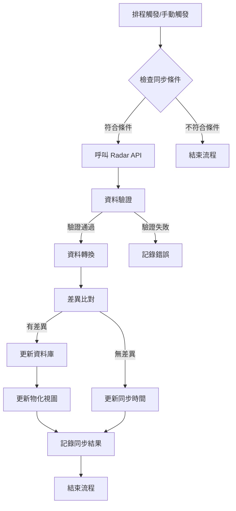
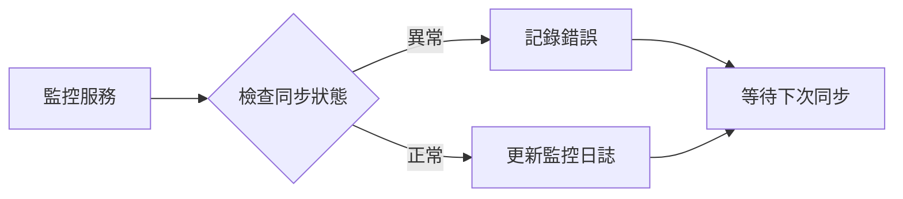
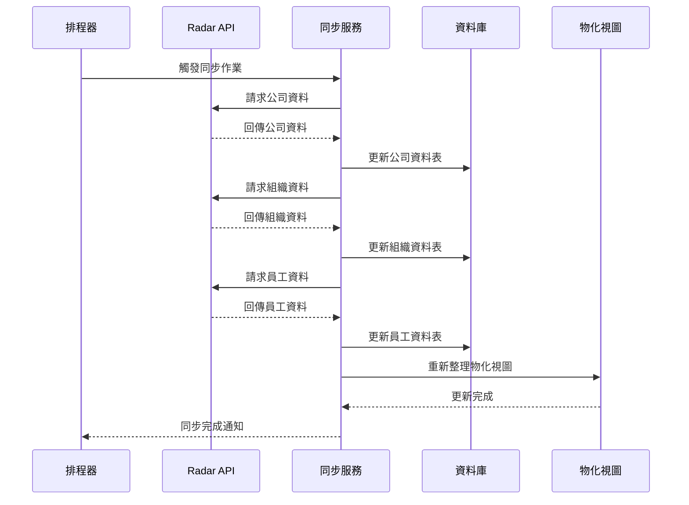
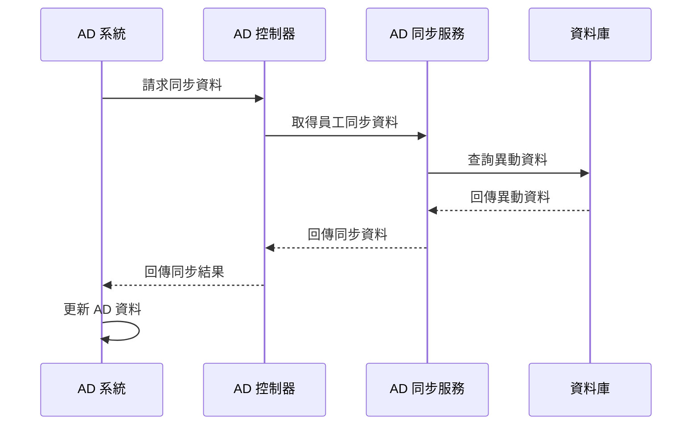

# SOGO 員工中台系統分析需求書

## 1. 系統概述

### 1.1 系統目標與範疇

本系統作為 SOGO 員工中台服務平台，主要目標為：

1. 提供統一的員工資料管理介面
2. 整合 Azure AD 帳戶管理功能
3. 與 Radar API 系統整合，同步員工資料
4. 提供 RESTful API 服務供其他系統使用
5. 確保資料的安全性與一致性

### 1.2 系統架構

#### 1.2.1 技術架構

1. 後端框架與函式庫
   - Spring Boot 2.7.18
   - Spring Security
   - Spring Data JPA
   - Spring Data JDBC
   - Spring Mail
   - Spring Validation
   - Lombok
   - JWT (jsonwebtoken 0.9.1)

2. 資料庫
   - PostgreSQL 42.7.4
   - JPA/Hibernate ORM

3. API 文件
   - Springdoc OpenAPI UI 1.6.9
   - Swagger UI

4. 開發工具
   - Java 8
   - Maven
   - Spring Boot DevTools

5. 監控與管理
   - Spring Boot Actuator

#### 1.2.2 系統層次

1. 表現層（Controller 層）
   - BpmApiController：處理 BPM 相關 API
   - ADSyncController：處理 AD 同步相關 API
   - FetchRadarDataController：處理 Radar 資料擷取 API

2. 業務邏輯層（Service 層）
   - 員工資料服務：APIEmployeeInfoService
   - 組織資料服務：APIOrganizationService
   - 組織關係服務：APIOrganizationRelationService
   - 組織管理者服務：APIOrganizationManagerService
   - 公司資料服務：APICompanyService
   - 物化視圖服務：MaterializedViewChangeService
   - BPM 相關服務：
     * Fse7enOrgDeptGradeInfoService
     * Fse7enOrgDeptInfoService
     * Fse7enOrgDeptStructService
     * Fse7enOrgJobTitle2GradeService
     * Fse7enOrgMemberInfoService
     * Fse7enOrgMemberStructService
   - 審批服務：EmployeeApprovalAmountService

3. 資料存取層（Repository 層）
   - JPA Repositories
   - JDBC Templates

4. 資料庫層
   - 資料表
   - 物化視圖
   - 索引與約束

### 1.3 使用者角色與權限

1. 系統管理員

   - 具備完整系統管理權限
   - 負責系統維護與監控
2. API 使用者

   - 外部系統介接使用
   - 具備特定 API 存取權限
3. AD 管理員

   - 負責 Azure AD 帳戶管理
   - 具備帳戶操作權限

## 2. 功能規格

### 2.1 核心功能模組

1. 員工資料管理
   - 員工基本資料維護（APIEmployeeInfoService）
     * 新增、更新、查詢員工資料
     * 處理員工狀態變更
     * 記錄員工資料異動歷史
   - 組織架構管理（APIOrganizationService）
     * 維護組織基本資料
     * 處理組織狀態變更
     * 記錄組織異動歷史
   - 組織關係管理（APIOrganizationRelationService）
     * 維護組織階層關係
     * 處理不同類型的組織樹
     * 記錄組織關係變更

2. BPM 系統整合
   - 部門資料查詢（Fse7enOrgDeptInfoService）
   - 部門等級管理（Fse7enOrgDeptGradeInfoService）
   - 部門結構查詢（Fse7enOrgDeptStructService）
   - 職稱職等對應（Fse7enOrgJobTitle2GradeService）
   - 成員資訊查詢（Fse7enOrgMemberInfoService）
   - 成員結構查詢（Fse7enOrgMemberStructService）
   - 審批額度管理（EmployeeApprovalAmountService）

3. Radar API 整合
   - 公司資料同步（APICompanyService）
     * 從 Radar API 獲取公司資料
     * 處理公司資料更新
   - 組織資料同步（APIOrganizationService）
     * 從 Radar API 獲取組織資料
     * 處理組織資料更新
   - 員工資料同步（APIEmployeeInfoService）
     * 從 Radar API 獲取員工資料
     * 處理員工資料更新
   - 組織管理者同步（APIOrganizationManagerService）
     * 從 Radar API 獲取管理者資料
     * 處理管理者資料更新

4. 資料同步管理
   - 物化視圖更新（MaterializedViewChangeService）
     * 追蹤視圖更新狀態
     * 記錄更新時間與結果
   - 資料異動記錄
     * 記錄所有資料變更
     * 保存變更歷史

### 2.2 API 服務規格

#### 2.2.1 BPM API 服務

1. 部門資料查詢

   ```
   主要參與者：BPM 系統
   前置條件：具備 API 存取權限
   基本流程：
   1. 呼叫相關 API：
      - GET /api/v1/bpm/dept-info：取得部門資訊
      - GET /api/v1/bpm/dept-grade-info：取得部門等級
      - GET /api/v1/bpm/dept-struct：取得部門結構
   2. 各 Service 層處理資料查詢
   3. 回傳格式化資料
   業務規則：
   - 資料分頁處理
   - 權限驗證
   ```
2. 職位管理

   ```
   主要參與者：BPM 系統
   前置條件：具備 API 存取權限
   基本流程：
   1. 呼叫 GET /api/v1/bpm/job-title-grade
   2. Fse7enOrgJobTitle2GradeService 處理查詢
   3. 回傳職稱與職等對應資料
   業務規則：
   - 維護職稱職等對應關係
   - 確保資料一致性
   ```
3. 審批額度管理

   ```
   主要參與者：BPM 系統
   前置條件：具備 API 存取權限
   基本流程：
   1. 呼叫 GET /api/v1/bpm/approval-amounts
   2. EmployeeApprovalAmountService 處理查詢
   3. 回傳審批額度設定
   業務規則：
   - 依據職等設定額度
   - 維護審批權限
   ```

#### 2.2.2 AD 同步 API 服務

1. 員工 AD 同步

   ```
   主要參與者：AD 管理員
   前置條件：員工資料已更新
   基本流程：
   1. 呼叫 GET /api/v1/ad-employee-sync-data
   2. 提供參數：
      - base-date: 基準日期
   3. ADSyncService 處理同步邏輯
   4. 更新 AD 帳戶狀態
   業務規則：
   - 只同步在職員工
   - 依據異動類型處理帳戶
   ```
2. 組織 AD 同步

   ```
   主要參與者：AD 管理員
   前置條件：組織資料已更新
   基本流程：
   1. 呼叫 GET /api/v1/ad-organization-sync-data
   2. 提供參數：
      - base-date: 基準日期
   3. ADSyncService 處理同步邏輯
   4. 更新 AD 組織結構
   業務規則：
   - 維護組織單位(OU)結構
   - 處理組織異動
   ```

#### 2.2.3 Radar 資料同步 API 服務

1. 系統初始化

```
端點：POST /system/initialization
用途：執行系統完整初始化
請求參數：無
回應格式：
{
    "code": "200",
    "message": "success",
    "data": {
        "status": "SUCCESS",
        "message": "資料庫初始化成功"
    }
}
業務邏輯：
- 依序執行以下同步作業：
  1. 同步公司資料
  2. 同步組織資料
  3. 同步組織關係
  4. 同步組織管理者
  5. 同步員工資料
- 記錄同步結果
```

2. 初始化公司資料

```
端點：POST /companies/initial-sync
用途：從 Radar API 同步公司資料
請求參數：無
回應格式：
{
    "code": "200",
    "message": "success",
    "data": "公司資訊同步成功"
}
業務邏輯：
- APICompanyService.processCompany() 處理資料更新
- 記錄同步日誌
```

3. 初始化組織資料

```
端點：POST /organizations/initial-sync
用途：從 Radar API 同步組織資料
請求參數：
- org-code：組織代碼（選填）
- base-date：基準日期（選填）
回應格式：
{
    "code": "200",
    "message": "success",
    "data": "組織資訊同步成功"
}
業務邏輯：
- APIOrganizationService.processOrganization() 處理更新
```

4. 初始化組織管理者

```
端點：POST /organization-managers/initial-sync
用途：從 Radar API 同步組織管理者資料
請求參數：
- org-code：組織代碼（選填）
- base-date：基準日期（選填）
回應格式：
{
    "code": "200",
    "message": "success",
    "data": "組織管理者資訊同步成功"
}
業務邏輯：
- APIOrganizationManagerService.processOrganizationManager() 處理更新
```

5. 初始化組織關係

```
端點：POST /organization-relations/initial-sync
用途：從 Radar API 同步組織關係
請求參數：
- tree-type：組織樹類型（必填）
回應格式：
{
    "code": "200",
    "message": "success",
    "data": "組織關係同步成功"
}
業務邏輯：
- APIOrganizationRelationService.processOrganizationRelation() 處理更新
```

6. 初始化員工資料

```
端點：POST /employees/initial-sync
用途：從 Radar API 同步員工資料
請求參數：
- employee-no：員工編號（選填）
- base-date：基準日期（選填）
回應格式：
{
    "code": "200",
    "message": "success",
    "data": "員工資訊同步成功"
}
業務邏輯：
- APIEmployeeInfoService.processEmployeeInfo() 處理更新
```

7. 查詢組織關係

```
端點：GET /organization-relations/fetch
用途：查詢特定類型的組織關係
請求參數：
- tree-type：組織樹類型（必填）
回應格式：
{
    "code": "200",
    "message": "success",
    "data": [{
        "orgCode": "string",
        "parentOrgCode": "string",
        "treeType": "string",
        "level": 0
    }]
}
業務邏輯：
- APIOrganizationRelationService.fetchOrganizationRelationByorgTreeType() 查詢關係
```

8. 檢查組織管理者

```
端點：GET /organization-managers/check
用途：檢查員工是否為特定組織的管理者
請求參數：
- employee-no：員工編號（必填）
- org-code：組織代碼（必填）
回應格式：
{
    "code": "200",
    "message": "success",
    "data": true/false
}
業務邏輯：
- APIOrganizationManagerService.existsByEmployeeNoAndOrgCode() 檢查權限
```

9. 取得並比對組織資訊

```
端點：POST /organizations/fetch-compare
用途：取得並比對組織資訊，產生同步 AD 資料
請求參數：
- org-code：組織代碼（選填）
- base-date：基準日期（必填，格式：yyyy-MM-dd）
回應格式：
{
    "code": "200",
    "message": "success",
    "data": "取得並比對組織資訊成功"
}
業務邏輯：
- APIOrganizationService.compareAndProcessOrganization() 比對並處理組織變更
```

10. 取得並比對員工資訊

```
端點：POST /employees/fetch-compare
用途：取得並比對員工資訊，產生同步 AD 資料
請求參數：
- employee-no：員工編號（選填）
- base-date：基準日期（必填，格式：yyyy-MM-dd）
回應格式：
{
    "code": "200",
    "message": "success",
    "data": "取得並比對員工資訊成功"
}
業務邏輯：
- APIEmployeeInfoService.compareAndProcessEmployeeInfo() 比對並處理員工變更
```

11. 取得空組織 DN 列表

```
端點：GET /empty-dns
用途：取得組織樹中沒有任何在職員工的組織 DN 列表
請求參數：
- treeType：樹狀結構類型（選填，預設值：0）
回應格式：
{
    "code": "200",
    "message": "success",
    "data": [
        "string"
    ]
}
業務邏輯：
- APIOrganizationService.getEmptyOrganizationDNs() 查詢空組織
```

### 2.3 業務流程

#### 2.3.1 員工資料同步流程



**流程說明：**

1. 觸發條件
   - 定時排程
   - 手動觸發（通過 API 呼叫）

2. 參與服務
   - APIEmployeeInfoService：處理員工資料同步
   - APIOrganizationService：處理組織資料同步
   - APICompanyService：處理公司資料同步
   - MaterializedViewChangeService：處理視圖更新

3. 業務規則
   - 資料驗證規則
     * 必填欄位檢查
     * 資料格式驗證
   - 差異比對規則
     * 欄位級別比對
     * 狀態變更檢查
   - 更新策略
     * 完全更新
     * 差異更新

4. 例外處理
   - API 連線異常處理
   - 資料驗證失敗處理
   - 系統錯誤處理

#### 2.3.2 資料同步監控流程



**監控重點：**

1. 同步效能指標
   - 透過 MaterializedViewChangeService 追蹤視圖更新
   - 記錄同步時間和異動筆數

2. 監控點
   - API 回應時間
   - 資料處理時間
   - 資料庫操作時間
   - 物化視圖更新時間

#### 2.3.3 實際案例說明

1. 新進員工資料同步
```
觸發條件：HR 系統建立新進員工資料
處理步驟：
1. APIEmployeeInfoService 獲取員工資料
2. 資料驗證與轉換
3. MaterializedViewChangeService 更新視圖
```

2. 組織異動同步
```
觸發條件：組織改組或調整
處理步驟：
1. APIOrganizationService 更新組織資料
2. APIOrganizationRelationService 更新組織關係
3. MaterializedViewChangeService 更新視圖
```

3. 員工狀態變更同步
```
觸發條件：員工狀態異動（如：離職）
處理步驟：
1. APIEmployeeInfoService 更新員工狀態
2. 記錄異動歷史
3. MaterializedViewChangeService 更新視圖
```

### 2.4 組織樹視覺化功能

#### 2.4.1 功能概述

組織樹視覺化功能透過 `orgtree.html` 提供以下功能：

1. 組織結構展示
   - 樹狀結構顯示組織層級關係
   - 支援展開/收合節點
   - 顯示組織代碼、名稱及層級資訊
   - 顯示子組織數量統計

2. 員工資訊整合
   - 在組織節點下顯示所屬員工列表
   - 顯示員工編號、職稱、姓名
   - 標示組織管理者身份
   - 僅顯示在職員工資訊

3. 搜尋功能
   - 依組織代碼搜尋
   - 依員工編號搜尋
   - 自動展開至目標節點
   - 高亮顯示搜尋結果

4. 資料匯出
   - 匯出成 Excel 格式
     * 包含組織層級、代碼、名稱
     * 包含所屬員工資訊
   - 匯出成 PowerShell 指令
     * 產生建立 AD OU 的指令
     * 包含組織描述資訊

#### 2.4.2 技術實現

1. 前端技術
   ```
   - HTML5
   - CSS3 (彈性布局)
   - JavaScript (原生)
   - XLSX.js (Excel 匯出)
   ```

2. 資料來源
   ```
   - 組織結構：/api/v1/organization-relations/fetch
   - 管理者確認：/api/v1/organization-managers/check
   - 資料格式：WholeOrgTreeDto
   ```

3. 視覺元素
   ```
   - 資料夾圖標：表示組織節點
   - 使用者圖標：表示員工
   - 紅色勾選：標示管理者
   - 展開/收合指示
   ```

4. 效能優化
   ```
   - 動態載入
   - 平滑滾動
   - 載入中提示
   ```

#### 2.4.3 使用案例

1. 查看組織結構
   ```
   步驟：
   1. 載入組織樹
   2. 點擊節點展開/收合
   3. 查看組織詳細資訊
   ```

2. 搜尋特定組織/員工
   ```
   步驟：
   1. 輸入搜尋條件
   2. 點擊搜尋按鈕
   3. 自動展開並捲動至目標
   4. 高亮顯示搜尋結果
   ```

3. 匯出組織資料
   ```
   步驟：
   1. 點擊匯出按鈕
   2. 選擇匯出格式
   3. 下載檔案
   ```

## 3. 資料架構

### 3.1 資料庫設計

#### 3.1.1 資料表結構

1. 員工相關資料表

   ```
   - api_employee_info：員工基本資料表
     * id (bigint)：主鍵
     * employee_no (varchar(10))：員工編號
     * full_name (varchar(50))：姓名
     * email_address (varchar(50))：電子郵件
     * ext_no (varchar(10))：分機號碼
     * employed_status (varchar(2))：在職狀態
     * hire_date (date)：到職日期
     * formula_org_code (varchar(20))：公式組織代碼
     * form_org_code (varchar(20))：表單組織代碼
     * function_org_code (varchar(20))：功能組織代碼
     * job_title_code (varchar(10))：職稱代碼
     * job_grade_code (varchar(10))：職等代碼
     * azure_account (varchar(50))：Azure 帳號
     * created_at (timestamp)：建立時間
     * updated_at (timestamp)：更新時間

   - api_employee_info_action_log：員工資料異動紀錄表
     * id (bigint)：主鍵
     * employee_no (varchar(10))：員工編號
     * action (varchar(10))：異動類型（新增/修改/刪除）
     * field_name (varchar(30))：異動欄位
     * old_value (varchar(50))：原始值
     * new_value (varchar(50))：新值
     * action_date (timestamp)：異動時間
     * created_at (timestamp)：建立時間

   - api_employee_info_archived：員工歷史資料表
     * id (bigint)：主鍵
     * employee_no (varchar(10))：員工編號
     * archive_date (date)：封存日期
     * archive_data (jsonb)：封存資料
     * created_at (timestamp)：建立時間
   ```
2. 組織相關資料表

   ```
   - api_organization：組織基本資料表
     * id (bigint)：主鍵
     * org_code (varchar(20))：組織代碼
     * org_name (varchar(50))：組織名稱
     * org_name_en (varchar(50))：組織英文名稱
     * status (varchar(2))：狀態
     * created_at (timestamp)：建立時間
     * updated_at (timestamp)：更新時間

   - api_organization_relation：組織關係表
     * id (bigint)：主鍵
     * org_code (varchar(20))：組織代碼
     * parent_org_code (varchar(20))：上級組織代碼
     * tree_type (varchar(2))：組織樹類型
     * level (int)：層級
     * created_at (timestamp)：建立時間
     * updated_at (timestamp)：更新時間

   - api_organization_manager：組織管理者表
     * id (bigint)：主鍵
     * org_code (varchar(20))：組織代碼
     * employee_no (varchar(10))：員工編號
     * status (varchar(2))：狀態
     * created_at (timestamp)：建立時間
     * updated_at (timestamp)：更新時間

   - api_organization_action_log：組織異動紀錄表
     * id (bigint)：主鍵
     * org_code (varchar(20))：組織代碼
     * action (varchar(10))：異動類型
     * field_name (varchar(30))：異動欄位
     * old_value (varchar(50))：原始值
     * new_value (varchar(50))：新值
     * action_date (timestamp)：異動時間
     * created_at (timestamp)：建立時間

   - api_organization_archived：組織歷史資料表
     * id (bigint)：主鍵
     * org_code (varchar(20))：組織代碼
     * archive_date (date)：封存日期
     * archive_data (jsonb)：封存資料
     * created_at (timestamp)：建立時間

   - api_organization_relation_action_log：組織關係異動紀錄表
     * id (bigint)：主鍵
     * org_code (varchar(20))：組織代碼
     * parent_org_code (varchar(20))：上級組織代碼
     * tree_type (varchar(2))：組織樹類型
     * action (varchar(10))：異動類型
     * action_date (timestamp)：異動時間
     * created_at (timestamp)：建立時間
   ```
3. 審批相關資料表

   ```
   - approved_amount_for_each_layer：各層級審批額度表
     * id (bigint)：主鍵
     * layer_id (varchar(20))：層級ID
     * amount (decimal(15,2))：審批額度
     * currency (varchar(3))：幣別
     * created_at (timestamp)：建立時間
     * updated_at (timestamp)：更新時間
   ```
4. 系統管理資料表

   ```
   - materialized_view_refresh_log：物化視圖更新紀錄表
     * id (bigint)：主鍵
     * view_name (varchar(50))：視圖名稱
     * refresh_time (timestamp)：更新時間
     * insert_count (int)：新增筆數
     * update_count (int)：更新筆數
     * delete_count (int)：刪除筆數
     * created_at (timestamp)：建立時間
   ```

### 3.2 資料字典

#### 3.2.1 代碼說明

1. 員工狀態代碼 (employed_status)

   ```
   1: 在職
   0: 離職
   2: 留職停薪
   3: 試用期
   ```
2. 組織樹類型 (org_tree_type)

   ```
   0: 公式組織
   1: 功能組織
   2: 表單組織
   ```
3. 資料狀態代碼 (status)

   ```
   1: 有效
   0: 無效
   2: 暫停
   3: 待審核
   ```
4. 異動類型代碼 (action)

   ```
   CREATE: 新增
   UPDATE: 修改
   DELETE: 刪除
   ARCHIVE: 封存
   RESTORE: 還原
   ```
5. 職等代碼 (job_grade_code)

   ```
   P1-P5: 專業職等
   M1-M5: 管理職等
   E1-E5: 執行職等
   ```

#### 3.2.2 資料完整性規則

1. 主鍵限制

   ```
   - 所有資料表都使用自增的 id 欄位作為主鍵
   - 業務邏輯識別碼規則：
     * employee_no：固定長度 10 碼
     * org_code：最大長度 20 碼
     * job_title_code：固定長度 10 碼
   ```
2. 外鍵關聯

   ```
   - api_employee_info_action_log：
     * employee_no 參照 api_employee_info(employee_no)

   - api_organization_relation：
     * org_code 參照 api_organization(org_code)
     * parent_org_code 參照 api_organization(org_code)

   - api_organization_manager：
     * org_code 參照 api_organization(org_code)
     * employee_no 參照 api_employee_info(employee_no)

   - api_organization_action_log：
     * org_code 參照 api_organization(org_code)
   ```
3. 資料驗證規則

   ```
   - 員工編號格式：
     * 必須為 10 碼
     * 第一碼為英文字母
     * 後 9 碼為數字

   - 電子郵件地址：
     * 必須符合 email 格式
     * 必須使用公司域名 (@sogo.com.tw)

   - 日期資料：
     * 到職日期不得晚於當前日期
     * 異動時間不得晚於當前時間

   - 組織代碼：
     * 最大長度 20 碼
     * 必須由英文字母或數字組成
     * 不得包含特殊字元
   ```
4. 唯一性限制

   ```
   - api_employee_info：
     * employee_no 唯一
     * email_address 唯一
     * azure_account 唯一

   - api_organization：
     * org_code 唯一

   - api_organization_relation：
     * org_code + parent_org_code + tree_type 組合唯一

   - api_organization_manager：
     * org_code + employee_no 組合唯一
   ```
5. 強制性欄位

   ```
   - api_employee_info：
     * employee_no
     * full_name
     * employed_status
     * hire_date

   - api_organization：
     * org_code
     * org_name
     * status

   - api_organization_relation：
     * org_code
     * tree_type
     * level
   ```
6. 稽核追蹤

   ```
   - 異動紀錄規則：
     * 所有異動都必須記錄在對應的 action_log 表
     * 必須記錄異動前後的值
     * 必須記錄異動時間和操作者

   - 封存規則：
     * 重要資料異動前先封存到 archived 表
     * 封存資料使用 jsonb 格式保存完整資訊
     * 封存時間必須記錄
   ```
7. 資料一致性規則

   ```
   - 組織架構一致性：
     * 組織關係不得形成循環
     * 同一組織樹類型中，組織層級必須連續
     * 組織狀態變更時，需同步更新相關資料

   - 員工資料一致性：
     * 在職員工必須至少屬於一個組織
     * 員工的主要職位只能有一個
     * 職稱必須對應到有效的職等
   ```

#### 3.3.1 視圖結構

系統使用以下物化視圖來優化查詢效能和資料整合：

1. **部門等級資訊視圖 (fse7en_org_deptgradeinfo)**

   - 用途：提供部門的階層等級資訊
   - 主要欄位：
     - grade_id：等級ID，格式為"Level" + 階層深度
     - display_name：顯示名稱，格式為"第X階"
     - grade_num：等級編號，格式為"-" + 階層深度
   - 資料來源：基於 api_organization_relation 和 api_organization 表
2. **部門基本資訊視圖 (fse7en_org_deptinfo)**

   - 用途：提供部門的基本資訊
   - 主要欄位：
     - org_code：組織代碼
     - org_name：組織名稱
   - 資料來源：基於 api_organization 和 api_organization_relation 表
3. **部門結構視圖 (fse7en_org_deptstruct)**

   - 用途：提供部門的階層結構資訊
   - 主要欄位：
     - org_code：組織代碼
     - parent_org_code：上級組織代碼
     - grade_id：等級ID
     - grade_num：等級編號
     - top_orgtree_code：最上層組織代碼
   - 資料來源：基於 api_organization_relation 和 api_organization 表
4. **成員資訊視圖 (fse7en_org_memberinfo)**

   - 用途：提供員工基本資訊
   - 主要欄位：
     - employee_no：員工編號
     - full_name：全名
     - ext_no：分機號碼
     - email_address：電子郵件地址
     - isterminated：離職狀態（0：在職，1：離職）
     - hire_date：到職日期
     - azureaccount：Azure帳號
   - 資料來源：基於 api_employee_info 表
5. **職稱等級對應視圖 (fse7en_org_jobtitle2grade)**

   - 用途：提供職稱與等級的對應關係
   - 主要欄位：
     - job_title_code：職稱代碼
     - job_title_name：職稱名稱
     - job_grade：職等
   - 資料來源：基於 api_employee_info 表
6. **成員結構視圖 (fse7en_org_memberstruct)**

   - 用途：提供成員在組織中的詳細資訊
   - 主要欄位：
     - employee_no：員工編號
     - full_name：全名
     - org_code：所屬組織代碼
     - org_name：組織名稱
     - job_title_code：職稱代碼
     - job_grade：職等
     - is_main_job：是否為主要職位（0：是，1：否）
     - approve_right：是否具有審批權限（0：否，1：是）
     - enable：是否啟用（0：否，1：是）
     - instructor：指導者資訊（格式：員工編號@組織代碼）
   - 資料來源：基於 api_employee_info 和 api_organization_manager 表

#### 3.3.2 資料更新機制

系統提供以下機制來確保物化視圖的資料即時性：

1. **物化視圖更新函數 (refresh_materialized_view_with_log)**

   - 功能：更新指定的物化視圖並記錄變更
   - 記錄內容：
     - 刪除的記錄數
     - 新增的記錄數
     - 更新的記錄數
     - 更新時間戳記
2. **批次更新函數 (refresh_all_materialized_views)**

   - 功能：依序更新所有物化視圖
   - 執行順序：按照資料相依性順序執行更新
3. **變更追蹤函數 (get_materialized_view_changes_by_date)**

   - 功能：查詢指定日期後的視圖變更記錄
   - 回傳資訊：
     - 視圖名稱
     - 更新時間
     - 變更筆數
     - 變更明細

## 4. 系統整合

### 4.1 外部系統介面

1. Radar API
   - 基礎 URL：https://uat-ehr.sogo.com.tw/DATAHUB
   - 認證方式：JWT Token
   - 主要功能：
     * 公司資料同步
     * 組織資料同步
     * 員工資料同步
     * 組織管理者同步

2. 郵件系統整合
   - SMTP 服務
   - 支援 STARTTLS
   - 用於系統通知

### 4.2 通訊協議

1. API 規範
   - RESTful API
   - OpenAPI 3.0 規範
   - Swagger UI 文件

2. 資料格式
   - JSON 格式
   - UTF-8 編碼
   - 時區：Asia/Taipei

### 4.3 整合限制

1. 技術限制
   - Java 8 環境要求
   - Spring Boot 2.7.18 框架
   - PostgreSQL 42.7.4 資料庫

2. 整合限制
   - Radar API 依賴性
   - 資料同步時效性要求

## 5. 非功能性需求

### 5.1 效能需求

1. 響應時間
   - API 響應時間 < 1 秒
   - 資料同步處理時間 < 30 分鐘

2. 資料庫效能
   - 使用物化視圖優化查詢
   - JPA/Hibernate 效能優化
   - 分頁查詢支援

### 5.2 安全性需求

1. 認證授權
   - JWT Token 認證
   - Spring Security 框架
   - 角色權限控制

2. 資料安全
   - 密碼加密存儲
   - 敏感資料保護
   - SQL 注入防護

### 5.3 可用性需求

1. 系統可用性
   - Docker 容器化部署
   - 自動重啟機制
   - 健康檢查端點

2. 監控與日誌
   - Spring Boot Actuator 監控
   - 分級日誌記錄
   - 日誌檔案輪替

### 5.4 可維護性需求

1. 程式碼品質
   - 遵循 Java 程式碼規範
   - 使用 Lombok 簡化代碼
   - 完整的 API 文件

2. 部署管理
   - Docker Compose 部署
   - 環境變數配置
   - 容器化管理

## 6. 部署與維運

### 6.1 部署環境

1. 容器化部署
   ```yaml
   服務名稱: ee-midd
   容器端口: 8080
   網絡模式: bridge
   重啟策略: unless-stopped
   ```

2. 資料庫配置
   ```yaml
   資料庫: PostgreSQL
   端口: 5433
   資料庫名: ee_midd
   時區: Asia/Taipei
   ```

3. 日誌配置
   ```yaml
   日誌級別: 
     - ROOT: INFO
     - 應用: DEBUG
     - Spring: DEBUG
   日誌檔案: /app/logs/ee-midd.log
   檔案大小: 10MB
   保留歷史: 5 個檔案
   ```

### 6.2 環境要求

1. 硬體需求
   - CPU: 2 核心以上
   - 記憶體: 4GB 以上
   - 硬碟: 50GB 以上

2. 軟體需求
   - Docker Engine
   - PostgreSQL 42.7.4
   - Java 8 Runtime

### 6.3 監控與維護

1. 系統監控
   - Actuator 端點監控
   - 資料庫連接監控
   - API 調用監控

2. 日誌管理
   - 應用程式日誌
   - 資料庫日誌
   - 系統錯誤日誌

## 7. 附錄

### 7.1 系統流程圖

#### 7.1.1 系統架構圖

```

#### 7.1.2 資料同步時序圖

1. Radar API 資料同步時序


2. AD 同步時序



### 7.2 API 使用案例

#### 1. BPM API 使用案例

1. 查詢部門等級資訊

```
端點：GET /api/v1/bpm/dept-grade-info
用途：取得部門等級階層資訊
請求參數：無
回應格式：
{
    "code": "200",
    "message": "success",
    "data": [{
        "gradeId": "Level1",
        "displayName": "第一階",
        "gradeNum": "-1"
    }]
}
業務邏輯：
- Fse7enOrgDeptGradeInfoService.findAll() 查詢所有部門等級
- 依照等級排序回傳結果
```

2. 查詢部門資訊

```
端點：GET /api/v1/bpm/dept-info
用途：取得部門基本資料
請求參數：無
回應格式：
{
    "code": "200",
    "message": "success",
    "data": [{
        "orgCode": "D001",
        "orgName": "資訊部"
    }]
}
業務邏輯：
- Fse7enOrgDeptInfoService.findAll() 查詢所有部門
- 依照組織代碼排序
```

3. 查詢部門結構

```
端點：GET /api/v1/bpm/dept-struct
用途：取得部門階層結構
請求參數：無
回應格式：
{
    "code": "200",
    "message": "success",
    "data": [{
        "orgCode": "D001",
        "parentOrgCode": "HQ",
        "gradeId": "Level2",
        "gradeNum": "-2"
    }]
}
業務邏輯：
- Fse7enOrgDeptStructService.findAll() 查詢結構
- 建立完整階層關係
```

4. 查詢職稱等級對應

```
端點：GET /api/v1/bpm/job-title-grade
用途：取得職稱與職等對應關係
請求參數：無
回應格式：
{
    "code": "200",
    "message": "success",
    "data": [{
        "jobTitleCode": "IT01",
        "jobTitleName": "資訊專員",
        "jobGrade": "P3"
    }]
}
業務邏輯：
- Fse7enOrgJobTitle2GradeService.findAll() 查詢職稱等級
- 依職等排序
```

5. 查詢成員資訊

```
端點：GET /api/v1/bpm/member-info
用途：取得所有成員基本資訊
請求參數：無
回應格式：
{
    "code": "200",
    "message": "success",
    "data": [{
        "employeeNo": "E001",
        "fullName": "王小明",
        "extNo": "1234",
        "emailAddress": "test@sogo.com.tw",
        "hireDate": "2024-01-01",
        "isTerminated": "0"
    }]
}
業務邏輯：
- Fse7enOrgMemberInfoService.findAll() 查詢成員資訊
- 格式化到職日期
```

6. 查詢成員結構

```
端點：GET /api/v1/bpm/member-struct
用途：取得成員組織結構關係
請求參數：無
回應格式：
{
    "code": "200",
    "message": "success",
    "data": [{
        "employeeNo": "E001",
        "fullName": "王小明",
        "orgCode": "D001",
        "orgName": "資訊部",
        "jobTitleCode": "IT01",
        "jobGrade": "P3",
        "isMainJob": "0",
        "approveRight": "1"
    }]
}
業務邏輯：
- Fse7enOrgMemberStructService.findAll() 查詢成員結構
- 整合職位與權限資訊
```

7. 查詢物化視圖變更

```
端點：GET /api/v1/bpm/view-changes
用途：查詢物化視圖的變更記錄
請求參數：
- date：查詢日期（必填）
- viewName：視圖名稱（選填）
回應格式：
{
    "code": "200",
    "message": "success",
    "data": [{
        "viewName": "fse7en_org_memberinfo",
        "changeTime": "2024-01-20 10:00:00",
        "insertCount": 10,
        "updateCount": 5,
        "deleteCount": 2
    }]
}
業務邏輯：
- MaterializedViewChangeService.getViewChangesByDate() 查詢變更
- 支援特定視圖或全部視圖查詢
```

8. 查詢審批額度

```
端點：GET /api/v1/bpm/approval-amounts
用途：查詢員工審批額度設定
請求參數：
- employeeNo：員工編號（選填）
回應格式：
{
    "code": "200",
    "message": "success",
    "data": [{
        "employeeNo": "E001",
        "fullName": "王小明",
        "jobGrade": "P3",
        "approvalAmount": 50000
    }]
}
業務邏輯：
- EmployeeApprovalAmountService.findAll() 查詢額度
- 依職等計算審批額度
```

#### 2. AD 同步 API 使用案例

1. 取得員工同步資料

```
端點：GET /api/v1/ad-employee-sync-data
用途：取得需同步至 AD 的員工資料
請求參數：
- base-date：基準日期（選填，預設為當天）
回應格式：
{
    "code": "200",
    "message": "success",
    "data": [{
        "employeeNo": "E001",
        "fullName": "王小明",
        "email": "test@sogo.com.tw",
        "status": "1",
        "action": "CREATE"
    }]
}
業務邏輯：
- ADSyncService.getADEmployeeSyncData() 查詢異動資料
- 只回傳基準日期後的異動記錄
- 包含新進、離職、資料異動等狀態
```

2. 取得組織同步資料

```
端點：GET /api/v1/ad-organization-sync-data
用途：取得需同步至 AD 的組織資料
請求參數：
- base-date：基準日期（選填，預設為當天）
回應格式：
{
    "code": "200",
    "message": "success",
    "data": [{
        "orgCode": "D001",
        "orgName": "資訊部",
        "parentOrgCode": "HQ",
        "status": "1",
        "action": "UPDATE"
    }]
}
業務邏輯：
- ADSyncService.getADOrganizationSyncData() 查詢異動資料
- 只回傳基準日期後的異動記錄
- 包含新增、刪除、異動等狀態
```

#### 3. Radar 資料同步 API 使用案例

1. 系統初始化

```
端點：POST /system/initialization
用途：執行系統完整初始化
請求參數：無
回應格式：
{
    "code": "200",
    "message": "success",
    "data": {
        "status": "SUCCESS",
        "message": "資料庫初始化成功"
    }
}
業務邏輯：
- 依序執行以下同步作業：
  1. 同步公司資料
  2. 同步組織資料
  3. 同步組織關係
  4. 同步組織管理者
  5. 同步員工資料
- 記錄同步結果
```

2. 初始化公司資料

```
端點：POST /companies/initial-sync
用途：從 Radar API 同步公司資料
請求參數：無
回應格式：
{
    "code": "200",
    "message": "success",
    "data": "公司資訊同步成功"
}
業務邏輯：
- APICompanyService.processCompany() 處理資料更新
- 記錄同步日誌
```

3. 初始化組織資料

```
端點：POST /organizations/initial-sync
用途：從 Radar API 同步組織資料
請求參數：
- org-code：組織代碼（選填）
- base-date：基準日期（選填）
回應格式：
{
    "code": "200",
    "message": "success",
    "data": "組織資訊同步成功"
}
業務邏輯：
- APIOrganizationService.processOrganization() 處理更新
```

4. 初始化組織管理者

```
端點：POST /organization-managers/initial-sync
用途：從 Radar API 同步組織管理者資料
請求參數：
- org-code：組織代碼（選填）
- base-date：基準日期（選填）
回應格式：
{
    "code": "200",
    "message": "success",
    "data": "組織管理者資訊同步成功"
}
業務邏輯：
- APIOrganizationManagerService.processOrganizationManager() 處理更新
```

5. 初始化組織關係

```
端點：POST /organization-relations/initial-sync
用途：從 Radar API 同步組織關係
請求參數：
- tree-type：組織樹類型（必填）
回應格式：
{
    "code": "200",
    "message": "success",
    "data": "組織關係同步成功"
}
業務邏輯：
- APIOrganizationRelationService.processOrganizationRelation() 處理更新
```

6. 初始化員工資料

```
端點：POST /employees/initial-sync
用途：從 Radar API 同步員工資料
請求參數：
- employee-no：員工編號（選填）
- base-date：基準日期（選填）
回應格式：
{
    "code": "200",
    "message": "success",
    "data": "員工資訊同步成功"
}
業務邏輯：
- APIEmployeeInfoService.processEmployeeInfo() 處理更新
```

7. 查詢組織關係

```
端點：GET /organization-relations/fetch
用途：查詢特定類型的組織關係
請求參數：
- tree-type：組織樹類型（必填）
回應格式：
{
    "code": "200",
    "message": "success",
    "data": [{
        "orgCode": "string",
        "parentOrgCode": "string",
        "treeType": "string",
        "level": 0
    }]
}
業務邏輯：
- APIOrganizationRelationService.fetchOrganizationRelationByorgTreeType() 查詢關係
```

8. 檢查組織管理者

```
端點：GET /organization-managers/check
用途：檢查員工是否為特定組織的管理者
請求參數：
- employee-no：員工編號（必填）
- org-code：組織代碼（必填）
回應格式：
{
    "code": "200",
    "message": "success",
    "data": true/false
}
業務邏輯：
- APIOrganizationManagerService.existsByEmployeeNoAndOrgCode() 檢查權限
```

9. 取得並比對組織資訊

```
端點：POST /organizations/fetch-compare
用途：取得並比對組織資訊，產生同步 AD 資料
請求參數：
- org-code：組織代碼（選填）
- base-date：基準日期（必填，格式：yyyy-MM-dd）
回應格式：
{
    "code": "200",
    "message": "success",
    "data": "取得並比對組織資訊成功"
}
業務邏輯：
- APIOrganizationService.compareAndProcessOrganization() 比對並處理組織變更
```

10. 取得並比對員工資訊

```
端點：POST /employees/fetch-compare
用途：取得並比對員工資訊，產生同步 AD 資料
請求參數：
- employee-no：員工編號（選填）
- base-date：基準日期（必填，格式：yyyy-MM-dd）
回應格式：
{
    "code": "200",
    "message": "success",
    "data": "取得並比對員工資訊成功"
}
業務邏輯：
- APIEmployeeInfoService.compareAndProcessEmployeeInfo() 比對並處理員工變更
```

11. 取得空組織 DN 列表

```
端點：GET /empty-dns
用途：取得組織樹中沒有任何在職員工的組織 DN 列表
請求參數：
- treeType：樹狀結構類型（選填，預設值：0）
回應格式：
{
    "code": "200",
    "message": "success",
    "data": [
        "string"
    ]
}
業務邏輯：
- APIOrganizationService.getEmptyOrganizationDNs() 查詢空組織
```
